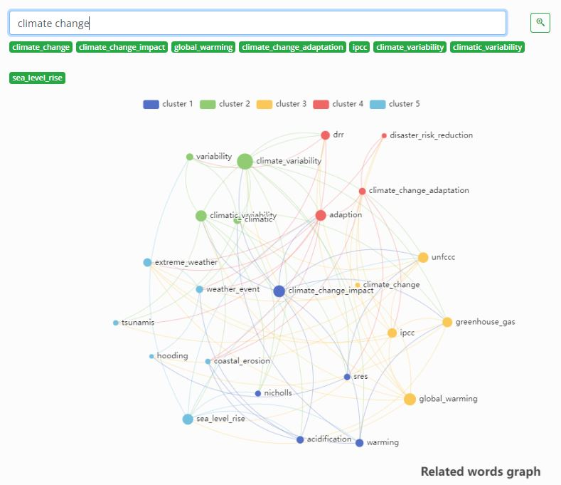
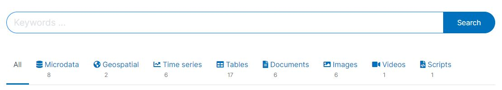

# The features of a modern data dissemination platform {#chapter02}

In the introductory section of this Guide, we proposed that modern data dissemination platforms should be modeled after the most successful e-commerce platforms. These platforms are optimized to serve both buyers (in our context, the data users) and sellers (in our context, the data providers) in the most efficient manner. Internet search engines, and in particular the way they exploit the capabilities of generative artificial intelligence, are also a useful source of inspiration for the design of data catalogs. In this chapter, we outline features that a modern online data catalog should incorporate to adhere to these models.

We provide recommendations for developing data catalogs that encompass lexical search and semantic search, filtering, advanced search functionality, interactive user interfaces, and the capability to operate as useful recommender systems. We approach the topic from three distinct perspectives: the viewpoint of **data users**, who represent a highly diverse community with varying needs, preferences, expectations, and capabilities; the standpoint of **data suppliers**, who either publish their data or delegate the task to a data library; and the perspective of **catalog administrators**, responsible for curating and disseminating data in a responsible, effective, and efficient manner while optimizing both user and supplier satisfaction.

The creation of a data dissemination platform is a collaborative endeavor, engaging data curators, user experience (UX) experts, user interface (UI) designers, search and systems engineers, and subject matter specialists with a profound understanding of both the data and the users' requirements and preferences. Inclusive in this development process should be the active participation of the users, allowing them to provide feedback that directly influences the system's design.

The set of features we describe below are proposed for a large data catalog, developed and mantained by a well-resourced organization. Not all features would be appropriate for a small catalog or for a catalog maintained by an organization facing technical and other constraints. In such situations, semantic search capability and the implementation of features that require the implementation of machine learning of generative artificial intelligence may not be recommended.

## Features for data users 

In order to cultivate a favorable user experience, online data catalogs must offer an intuitive and efficient interface, allowing users to effortlessly access the most pertinent datasets. To meet user expectations effectively, one should emphasize **simplicity** and **relevance**. A data dissemination platform should also be made accessible free of discrimination. The Web Content Accessibility Guidelines (WCAG) international standard provides principles and recommendations for accessibility to people with disabilities. Integrating these principles into the design of data catalogs can deliver a seamless and user-friendly experience, akin to the convenience and ease provided by internet search engines and e-commerce platforms. 

Users of a data catalog will typically want to **search** and **filter** the assets available in a catalog. They will also wantto **browse** and possibly **sort** the catalog entries or the entries returned by running a search or by activating a filter. We describe below how the search, filtering, browsing, and sorting features may be designed to provide a user-friendly experience. **Other features** of a data catalog that may be useful to users are also proposed, including features enabled by artificial intelligence, which are to a large extent in exploratory stage.

As artificial intelligence (AI) and machine learning (ML) solutions continue to advance, there emerges a capacity for these search engines to go beyond merely delivering a ranked list of results. In certain scenarios, particularly when the nature and content of a user's query permit, the search algorithm can generate a more direct and informative response. This could take the form of a conversational reply, synthesized through generative AI, or the presentation of structured data grids and visualizations that directly address the query. For such capabilities to be effectively implemented, the system must exhibit a level of intelligence that allows it to discern the appropriate response strategy. This involves parsing the intricacies of the query, recognizing patterns, and making informed decisions on whether to provide a direct answer or adhere to the conventional approach of returning a ranked list of resources. The fusion of advanced AI and ML technologies with search engines in data catalogs marks a significant evolution, empowering users with more nuanced and contextually relevant information retrieval experiences.

### Search 

Search engines implemented in data catalogs can be categorized as either *lexical* or *semantic*, or they may seamlessly integrate elements of both. A lexical search, also referred to as a keyword or full-text search, operates by matching literal terms from a user query to the search engine's index, subsequently returning datasets whose indexed metadata includes the specified terms. On the other hand, a semantic search strives to pinpoint datasets with metadata that bears semantic resemblance to the query. Ideally, a comprehensive data catalog would incorporate both lexical and semantic search engines, seamlessly blended into a unified search tool. However, the integration of semantic search functionality presents a complexity in implementation.

Semantic search leverages advanced techniques like embeddings, vector indexing, and similarity measures to enhance the precision and relevance of search results by capturing the semantic meaning of user queries and dataset content. The process typically involves converting words or phrases into high-dimensional vectors using embeddings. Embeddings are representations of words or phrases in a continuous vector space, where semantically similar terms are positioned closer to each other.

Vector indexing in specialized *vector databases* is a key aspect of semantic search. These databases, such as Milvus or Qadrant, are optimized for storing and querying high-dimensional vectors efficiently. They enable the indexing of embeddings associated with both user queries and catalog resources, allowing for fast and accurate similarity searches.

Cosine similarity is a common measure used in semantic search to quantify the similarity between vectors. In a vector space, the cosine of the angle between two vectors is calculated, with a higher cosine indicating greater similarity. This measure is instrumental in ranking and retrieving datasets based on their semantic relevance to a user's query.

To facilitate the implementation of semantic search, APIs play a crucial role. APIs for generating embeddings streamline the process by providing access to pre-trained models or embedding services. These APIs take care of the complex task of converting textual data into meaningful embeddings, saving time and resources for developers. Additionally, APIs for search engines allow the integration of semantic search capabilities seamlessly, enabling the retrieval of relevant results based on semantic similarity.

In a search engine, semantic search is often combined with lexical search to offer a comprehensive and effective discovery system. Lexical search involves matching literal terms in a user query to the search engine's index, while semantic search focuses on identifying datasets with semantically similar metadata. Combining these approaches ensures a balanced and robust search system, catering to a wide range of user preferences and query styles.

In summary, semantic search is a powerful approach that involves embeddings, vector indexing, and similarity measures to provide users with more contextually relevant results. Specialized vector databases, APIs for embeddings, and a combination with lexical search contribute to the seamless implementation of semantic search in data catalog search engines, enhancing the overall user experience and discovery capabilities.

#### Search box

In a data catalog, the primary means of searching for data is typically through a single, intuitive search box. Recognizing the diversity in users' search capabilities, the search engine must be designed to accommodate a range of query inputs, acknowledging that not all users will craft perfect queries. 

To enhance user experience and overcome potential spelling errors, the search engine may leverage advanced indexing tools such as Solr or ElasticSearch. Additionally, users should have the flexibility to input queries either through traditional keyboard entry or via audio commands.

 

 

Ensuring a nuanced understanding of user queries, the search engine should employ sophisticated processes, including automated query parsing and enhancement. This parsing mechanism extracts crucial information from the query, discerning factors such as the type of data under consideration, whether the query pertains to specific indicators within the catalog assets, references to geographic locations, time-related elements, and the suitability of a keyword search versus a semantic search. The system also endeavors to detect the language of the query and, if necessary, offers translation services.

A pivotal aspect of the search engine's functionality lies in its ability to decipher the user's intent and return results ranked by relevance. This demands an intricate analysis of the query, potentially leading to immediate answers. Depending on the nature of the query, the application must intelligently determines whether to present results in textual form, organize them in a data grid, or generate visualizations for a more comprehensive understanding. This multifaceted approach ensures that users can interact seamlessly with the data catalog, obtaining the most pertinent information in a manner that aligns with their preferences and requirements.

#### Document as a query

A search engine equipped with semantic search capabilities extends its user-friendly functionality by accommodating queries of varying lengths, including the innovative option for users to submit entire documents—whether in PDF or TXT format—as queries. Upon receiving a document query, the search engine initiates a sophisticated process wherein it meticulously analyzes the semantic content within the document. This involves transforming the document into an embedding vector, a compact representation capturing its semantic essence. Subsequently, the search engine adeptly identifies and retrieves the most relevant resources from the catalog, ensuring a nuanced and contextually rich response to the user's document-based query.

 

 

#### Image as a query

A cutting-edge search engine, empowered with advanced image search capabilities, introduces an innovative dimension to user interaction by enabling the submission of images as queries. Users can seamlessly upload images in various formats, unlocking a novel means of exploration. Upon receiving an image query, the search engine embarks on a sophisticated journey, meticulously analyzing the visual content embedded in the image. Through intricate processes such as feature extraction and image embedding, the search engine translates the visual information into a compact and meaningful representation. Leveraging this representation, the search engine then identifies and retrieves the most pertinent resources from the catalog, delivering a tailored and visually aligned response to the user's image-based query. This transformative capability enhances the search experience, allowing users to explore and discover relevant content through the lens of visual input.

#### Suggested queries

Contemporary search engines can further enrich the user experience by the proactive generation of pertinent and refined query suggestions. Beyond merely processing user queries, these advanced search engines leverage sophisticated techniques to automatically propose alternative queries that are more useful and relevant. This intelligent feature is often implemented through the utilization of expansive graphs of related words, crafted by state-of-the-art Natural Language Processing (NLP) models. By tapping into the inherent semantic relationships between words, these graphs offer a comprehensive understanding of language nuances.

To implement such dynamic query suggestions, seamless integration with an API becomes imperative. This API facilitates the retrieval of insightful keyword recommendations grounded in the intricate web of semantic connections identified by NLP models. Users benefit from a fluid and intuitive search experience as the search engine anticipates their needs and refines their queries in real-time. This proactive query suggestion mechanism stands as a testament to the evolving landscape of search technology, where the fusion of NLP and intelligent algorithms empowers users with not only accurate search results but also a collaborative and responsive search process.

 

{width=100%}

 

A search interface could retrieve such information via API and display it as follows:

 

{width=100%}

 

#### Advanced search 

Advanced search are enabled by structured metadata, i.e., by the use of metadata standards and schemas. Accessible through an intuitive user interface, an *advanced search* option provides users with a dynamic and interactive platform to specify their search criteria. Users can pinpoint their focus to distinct metadata fields, enabling a fine-grained exploration of datasets within the catalog. Furthermore, to cater to users familiar with syntax-based queries, the Advanced Search offers a syntax option, granting more adept users the flexibility to craft complex search queries using boolean operators.

Whether through the user-friendly interface or the syntax option, the Advanced Search capability provides a comprehensive and tailored search experience. This feature not only acknowledges the diverse needs of users but also reflects the catalog's ability to facilitating efficient and precise data discovery through the judicious use of structured metadata.

 

{width=85%}

 

This would correspond to the following syntax that the user could enter directly in the search box (and save and/or share with others):
 

**title:"demographic transition" AND country:(*Kenya*) AND body:(poverty)**

 

#### Geographic search

Geographic discoverability and searchability within data catalogs are critical components that cater to the diverse needs of users seeking information pertaining to specific geographic areas. Data catalogs routinely receive a substantial volume of queries centered around particular regions, whether at the country level, sub-national entities, or non-administrative geographic features like watersheds and oceans. In the context of data catalogs housing geographic datasets, it becomes imperative to offer specialized search tools that enhance the precision and relevance of spatial data discovery.

While metadata standards often allow the utilization of bounding boxes to specify geographic coverage, this method has inherent limitations that make it imperfect. Drawing a box on a map to define an area oversimplifies the complexity of geographical features, particularly when users are interested in irregular or non-standard shapes. To address this limitation, it is recommended to incorporate advanced geographic search tools that provide users with more nuanced ways to explore datasets based on their spatial characteristics.

Geographic indexing emerges as a powerful solution for datasets with explicit geographic content. The H3 index, known for its hierarchical hexagonal structure, proves to be a robust option. The hierarchical nature of the H3 index facilitates efficient aggregation and retrieval of data at various levels of granularity, offering an effective means to enhance the geographic discoverability of datasets within a catalog. By adopting geographic indexing, the catalog ensures that users can precisely identify and access datasets relevant to their spatial requirements.

Recognizing that many users rely on keyword searches to discover data, it is also essential to address the challenges associated with incomplete metadata coverage. For instance, a raster image of the Philippines obtained from satellite imagery may contain the country name in its metadata. Still, specific sub-national areas like "Iloilo" may not be explicitly mentioned. To overcome this limitation, a sophisticated search engine should implement intelligent query parsing. This involves detecting if a user query contains the name of a geographic area, automatically identifying the corresponding polygon of geographic coordinates. This process can be facilitated by leveraging APIs such as Nominatim. Subsequently, the search engine retrieves relevant resources in the catalog that cover the specified geographic area, underscoring the importance of geographically indexing datasets to enable accurate and comprehensive results.

This integrated approach ensures that users can seamlessly navigate and explore geographic datasets within the catalog, whether through advanced search tools, geographic indexing, or intelligent keyword parsing, thereby fostering a robust and user-centric data discovery experience.

 

 

Example of use of Nominatim: The Nominatim application shows the polygon boundary for the search query “Iloilo City” automatically provided by the API.

 

 

The search API endpoint of Nominatim returns this JSON data which can be processed to generate search cell(s).

 

 

#### Ranking results 

A search engine must not only identify relevant datasets but also present them in an ordered list based on their level of relevance. The ranking of results directly influences users' ability to quickly find pertinent information, with the most relevant outcomes prominently positioned at the top. If users do not encounter relevance in the initial results, there's a risk of them seeking data from alternative sources, emphasizing the critical role of effective result ranking in user satisfaction and retention.

Achieving optimal result ranking hinges on the careful consideration of both the content and structure of metadata. Relevance engineering plays a pivotal role in this process, requiring fine-tuning of advanced search tools such as Solr or ElasticSearch. This is a crucial step in ensuring that the search engine not only identifies relevant datasets but also presents them in a manner that aligns with users' expectations.

Optimizing keyword-based searches is integral to effective result ranking. While out-of-the-box solutions like those provided by SQL databases may fall short, advanced indexing tools such as Solr and ElasticSearch offer robust mechanisms for enhancement. Structured metadata proves to be a key ally in this optimization effort, enabling the boosting of specific metadata elements. For instance, a query term found in the title holds greater weight than if found in notes, and results are ranked accordingly. Similarly, attributing more weight to a country name found in designated metadata elements like nation or reference country ensures that results align with the contextual relevance of the query.

Furthermore, advanced indexing tools provide additional functionalities, including grouping, sequencing, and proximity-based considerations, further refining the result ranking process. The boosting capabilities offered by tools like Solr and ElasticSearch empower search engines to adapt and align with the nuanced preferences of users, ultimately contributing to an enhanced and efficient data discovery experience.

For large data catalogs managed by well-resourced agencies, the exploration of machine learning solutions, particularly "learn-to-rank" techniques, offers an avenue for result ranking enhancement. This involves leveraging the expertise of data scientists to develop models that can intelligently weigh and prioritize results based on relevance, contributing to an improved and personalized user experience. 

#### Saving and sharing results

Empowering users with the ability to save, export, and share their search queries within a data catalog search engine enhances the overall utility and collaborative potential of the platform. The option to save a search query for future re-use provides users with a convenient way to revisit and refine their information retrieval strategies. This is particularly beneficial for users engaging in recurrent or complex data exploration, allowing them to streamline their workflow and save time.

The capability to export search results is equally crucial, offering users the flexibility to analyze and manipulate the obtained data outside the confines of the search engine. Exported results, whether in the form of downloadable files or accessible URLs, enable seamless integration with external tools and applications for further analysis or visualization.

Sharing functionalities contribute to the collaborative aspect of data exploration. Enabling users to share both their saved queries and the results with others fosters knowledge exchange and collaboration within the user community. The option to share via social media platforms adds an additional layer of accessibility, allowing users to disseminate valuable insights to a broader audience and potentially connect with others who share similar interests or objectives.

In essence, the ability to save, export, and share search queries and results not only enhances the individual user experience by facilitating efficient workflow management but also promotes collaboration, knowledge-sharing, and community engagement within the data catalog ecosystem. This collaborative dimension contributes to the creation of a more dynamic and interactive user community, fostering a culture of shared insights and collective learning.

### Filtering

The incorporation of filtering options, such as facets or other navigational tools, alongside a search engine within a data catalog is of paramount importance. While search engines excel at pinpointing specific items based on user queries, filtering options complement this functionality by enabling users to refine and explore the catalog comprehensively. These filters empower users to navigate through extensive datasets with precision, allowing them to narrow down results based on criteria such as data type, date range, or specific attributes. This not only streamlines the browsing experience for users seeking specific subsets of information but also facilitates a more nuanced exploration of the entire catalog. By offering both a powerful search engine and versatile filtering mechanisms, a data catalog ensures that users can efficiently uncover relevant data through tailored search queries or by dynamically refining their exploration of the complete catalog or search results.

#### Facets 

Facets, also referred to as *filters*, play a crucial role in enhancing the usability of a data catalog by allowing users to refine their searches and navigate through datasets with precision. Structured metadata and controlled vocabularies form the backbone of these facets, providing a systematic framework for categorizing and organizing information. For example, in a data catalog featuring datasets from various countries, a "country" facet can serve as a powerful filter, enabling users to swiftly locate relevant datasets associated with specific geographic regions. The effectiveness of these filters hinges on metadata elements characterized by a limited number of categories and a predictable set of options, which is facilitated through the use of controlled vocabularies.

In the user interface (UI) of a data catalog, the visibility and accessibility of activated filters are paramount. UI design should prioritize making activated filters easily noticeable and providing a straightforward mechanism for deactivation, such as the use of filter "pills" that can be conveniently toggled on and off. This ensures that users have a transparent and intuitive means of managing their refined search criteria. Additionally, recognizing that certain metadata elements are inherently tied to specific data types, the integration of contextual facets within the catalog's UI becomes essential. These contextual facets dynamically offer relevant filters based on the type of data being searched, further optimizing the user experience and facilitating efficient exploration of the catalog's diverse datasets.

{width=100%}

 

Tags and tag groups (which are available in all schemas we recommend) provide much flexibility to implement facets, as we showed in section 1.7. 

#### Organizing entries by collections

Organizing data assets into virtual collections within catalogs significantly enhances users' ability to navigate and discover relevant information efficiently. These collections, which can be structured thematically, geographically, by sponsor, producer, or any other relevant criteria, serve as intuitive groupings (and filters) that streamline the search process. For instance, datasets may be grouped by the origin of the data, geographic coverage, or thematic focus. The virtual nature of collections allows a single data asset to belong to multiple collections simultaneously, recognizing the multidimensional nature of datasets. Each collection must come with a brief descriptive overview, providing users with valuable context about the content it encompasses. 

#### Organizing entries by data type

Organizing data assets within a data catalog by main data type facilitates user navigation and ensures that individuals can easily locate the specific information they seek. In a catalog encompassing diverse data types such as microdata, indicators, geographic datasets, documents, and more, offering a streamlined mechanism for users to filter and display query results by data type is paramount. This functionality accommodates the varied needs of users conducting searches with distinct objectives.

Consider a scenario where users are searching for "US population." One user may be interested solely in obtaining the total population of the USA, while another might specifically seek the public use census microdata sample, and a third may be looking for a relevant publication. To cater to these diverse needs, presenting query results in type-specific tabs (with an "All" option) or providing a filter (facet) by type becomes instrumental. This approach empowers users to focus on the particular data types that align with their requirements, streamlining the information retrieval process.

By implementing such features, data catalogs not only enhance user experience but also cater to the varying capacities and expertise of users. For example, users without statistical analysis expertise may prefer to filter out microdata, focusing only on data types that align with their capabilities. This organization and filtering by data type contribute to a more personalized and user-centric service, ensuring that individuals can efficiently access and utilize the data most relevant to their specific needs and competencies.

{width=100%}

 

#### Filtering by access type 

Organizing data assets within a data catalog by mode of access and access policy also contributes to ensuring that users can easily identify and access datasets aligned with their specific needs, preferences, and compliance requirements. The mode of access, whether through bulk download, API, or other means, serves as a critical factor for users who may have distinct preferences or technical capabilities. For instance, some users might prefer bulk download options for offline analysis, while others may seek real-time access through APIs.

Equally important is the categorization of datasets based on access policies. Clear and transparent access policies, preferably articulated through a standard license and utilizing a controlled vocabulary, provide users with essential information regarding the type of access granted. This could include distinctions between open access, public use files, licensed access, or access within a secure data enclave. The use of controlled vocabulary enables the creation of a facet (filter) that allows users to refine their search based on specific access conditions.

Making access policies prominently visible in the data catalog is essential for user understanding and compliance. A standardized presentation, potentially through a facet, allows users to quickly filter datasets based on their preferred level of access and usage rights. Additionally, any specific access conditions, restrictions, or requirements should be clearly communicated to users to ensure transparency and adherence to relevant legal and ethical considerations. In this way, organizing data assets by mode of access and access policy not only simplifies the user's navigation of the catalog but also contributes to a more informed and responsible use of the available datasets.

{width=100%}

 

### Browsing

Browsing a data catalog refers to the process of exploring and navigating through the catalog's contents to discover relevant datasets or information. Unlike targeted searches that involve specific queries, browsing involves a more exploratory approach, allowing users to casually peruse the catalog's offerings. It is akin to strolling through the aisles of a library or scanning the shelves of a bookstore to see what catches your interest.

In the context of a data catalog, browsing typically involves navigating through categories, collections, or filters that organize datasets based on thematic, geographic, or other criteria. Users might scroll through a list of datasets, explore collections related to specific topics, or filter results based on certain attributes. The goal is to serendipitously come across valuable data assets, discover new insights, or identify datasets that align with the user's interests or project requirements.

Effective browsing in a data catalog often relies on well-organized metadata, clear categorization, and intuitive user interfaces. Browsing functionality can encompass various features such as filters, facets, and sorting options, enabling users to refine their exploration and focus on datasets that match their criteria. Ultimately, the browsing experience in a data catalog is designed to be user-friendly, encouraging users to efficiently explore and discover the wealth of information available within the catalog's repository.

#### Providing core information in the listing page

Designing a data catalog with a concise and informative listing page, presented in the form of a card, is crucial for optimizing user experience and aiding efficient decision-making. This card format should encapsulate key details such as entry title, period, geographic coverage, producer, API availability, a brief description, and potentially a logo. By encapsulating these essential elements in a compact display, users can swiftly evaluate the relevance of a dataset without the need to navigate to a separate page.

The entry title serves as a focal point, providing a quick overview of the dataset's main subject. Period and geographic coverage offer immediate insights into the temporal and spatial dimensions of the data. Knowing the producer lends credibility and context to the dataset, while information on API availability indicates the level of accessibility and functionality for technically inclined users. A concise description complements these details, offering a snapshot of the dataset's purpose and content. Including a logo enhances visual recognition, especially for datasets associated with specific organizations or brands.

This streamlined presentation ensures that users can make informed decisions about exploring further details without the need to open multiple pages. The goal is to empower users with enough information upfront, streamlining their browsing experience and enabling efficient decision-making regarding the datasets most relevant to their needs. Ultimately, the catalog card functions as a powerful tool to engage users, providing a snapshot of critical information and enticing them to delve deeper into datasets that align with their specific interests and requirements.

#### Highlights and most popular entries

Highlighting popular datasets or those strategically promoted by catalog administrators serves as a valuable guide for users seeking the most relevant and frequently accessed information. This feature streamlines the user experience by directing attention to datasets that have garnered widespread interest or are considered particularly valuable. It not only expedites the search process but also provides users with insights into what datasets are trending or widely utilized by their peers. Additionally, catalog administrators can leverage this feature to promote datasets that align with organizational goals, encouraging users to explore and utilize resources that are strategically significant. 

#### Recent additions and history

Providing users with a list of the "latest additions" and maintaining a history of additions and modifications in a data catalog is highly useful for several reasons.

- Stay Updated: The "latest additions" feature allows users to quickly identify and access the most recently added datasets. This is particularly valuable for users who want to stay up-to-date with the latest information or who are interested in newly available datasets that might be relevant to their work or research.

- Track Changes: A history of additions and modifications provides transparency and accountability. Users can track changes made to datasets over time, including updates, revisions, or corrections. This history is crucial for maintaining data integrity and ensuring users are aware of any changes that may impact their use of the data.

- Version Control: For datasets that undergo multiple versions or updates, a history log helps users understand the evolution of the data. This version control is essential for researchers, analysts, or anyone relying on specific versions of datasets for consistency and reproducibility in their work.

- Enhance Trust: Transparency in the catalog's modification history builds trust among users. Knowing when and how datasets have been added or modified contributes to the credibility of the catalog and the reliability of the data it contains.

 

 

#### Metadata display and formats

To make metadata easily accessible to users, it is important to display it in a convenient way. The display of metadata will vary depending on the data type being used, as each type uses a specific metadata schema. For online catalogs, style sheets can be utilized to control the appearance of the HTML pages.

In addition to being displayed in HTML format, metadata should be available as electronic files in JSON, XML, and potentially PDF format. Structured metadata provides greater control and flexibility to automatically generate JSON and XML files, as well as format and create PDF outputs. It is important that the JSON and XML files generated by the data catalog comply with the underlying metadata schema and are properly validated. This ensures that the metadata files can be easily and reliably reused and repurposed.

{width=100%}

 

#### Variable-level comparison

This features is specific to microdata. E-commerce platforms commonly allow customers to compare products by displaying their pictures and descriptions side-by-side. Similarly, for data users, the ability to compare datasets can be valuable to evaluate the consistency or comparability of a variable or an indicator over time or across sources and countries. However, to implement this functionality, detailed and structured metadata at the variable level are necessary. These metadata standards, such as DDI and ISO 19110/19139, enable the implementation of this feature. In the example below, we show how a query for *water* returns not only a list of seven datasets, but also a list of variables in each dataset that match the query.

{width=100%}

 

The *variable view* shows that a total of 90 variables match the searched keyword.

{width=100%}

 

After selecting the variables of interest, users should be able to display their metadata in a format that facilitates comparison. The availability of detailed metadata is crucial to ensure the quality and usefulness of these comparisons. For example, when working with a survey dataset, capturing information on the variable universe, categories, questions, interviewer instructions, and summary statistics would be ideal. This comprehensive metadata will enable users to make informed decisions about which variables to use and how to analyze them.

{width=100%}

 

#### Image mosaic view

If the catalog contains entries of type "image", a mosaic view should be provided in addition to the listing view. The availability of a mosaic view in an image catalog offers users a highly convenient and visually intuitive way to explore and navigate through a large collection of images. A mosaic view typically presents a grid or tiled layout of images, allowing users to see multiple thumbnails simultaneously on a single screen.

Here are several conveniences for users provided by a mosaic view in an image catalog:

   - Efficient visual scanning: A mosaic view enables users to efficiently scan and preview a large number of images at once. This is particularly valuable when users are seeking specific images or trying to get a quick overview of the content available in the catalog.
   - Rapid identification: Users can quickly identify images of interest based on their visual content without the need to open individual files. The mosaic layout provides a holistic view, aiding in the rapid identification of relevant images.
   - Contextual understanding: Seeing images side by side in a mosaic view allows users to grasp contextual relationships and patterns that may not be apparent when viewing images individually. This is particularly beneficial when exploring thematic or chronological relationships among images.
   - Streamlined selection Process: Users can efficiently select multiple images for further actions, such as downloading, sharing, or organizing. This streamlines the selection process, enhancing user productivity and reducing the time required to interact with the catalog.
   - Enhanced user experience: The visual appeal of a mosaic view enhances the overall user experience. It provides an engaging and interactive way for users to interact with the image catalog, making the exploration of images more enjoyable and user-friendly.

The images should be organized into albums.

#### Data preview

The inclusion of a data preview feature in a data catalog is convenient for users as it allows them to get a quick glimpse of the dataset's content without having to download or open the entire file. This feature is particularly beneficial for assessing data relevance, structure, and quality before committing to a full download or exploration.

For tabular data, such as indicators or microdata, the convenience is further amplified by various options to display the data in user-friendly data grids. These grids present the tabular data in a structured and readable format, making it easy for users to interpret and analyze the information. Additionally, the preview feature often accommodates customization options, allowing users to choose specific columns or rows for display, focusing on the most relevant aspects of the data.

In the case of large datasets, a preview feature typically offers a sample of the data rather than the entire dataset. This is practical for several reasons. First, it provides users with a representative subset of the data, offering insights into its characteristics without overwhelming them with excessive information. Second, displaying a sample helps manage resource constraints associated with loading and rendering large datasets, ensuring a smooth and responsive user experience.

The implementation of such a feature requires that the data be available via API.

{width=80%}

For data of type "document", the "data preview" would consist of a document viewer that would allow the user to view the document within the application (even when the document is not stored in the catalog itself but in an external website). When implementing such a feature, check that the terms of use of the origination source allows that.

 

 

For data of type "video", an option to play the video in the catalog itself should be provided. Typically, this will require publishing the video in an on-line service like Youtube, and embedding it into the catalog page.

#### Visualizations

Integrating visualizations into a data catalog significantly enhances its utility by providing users with an immediate, insightful understanding of the data. Visualizations serve as powerful tools for efficient data comprehension and analysis. Tailoring the visualization type to the nature of the data is crucial; for instance, time series data can be effectively communicated through line charts, while geographically tagged images find clarity on a map. For more intricate datasets, diverse chart types can be employed. Embedding dynamic charts into catalog pages requires data accessibility through APIs. An effective data catalog should offer versatility in the types of charts and maps that can be integrated into metadata pages. The system should support the development of widgets using various tools, such as open-source JavaScript libraries. These widgets, combined with API-accessible data, enable the presentation of custom visualizations in a flexible manner. Establishing a repository of visualizations and widgets simplifies their implementation, ensuring users can effortlessly leverage these tools for enhanced data exploration and interpretation.

 
*Example: Line chart for a time series*

{width=100%}

 
*Example: Geo-location of an image*

{width=100%}

 

#### Information on API access

Comprehensive documentation of API access within data catalogs is crucial for effective utilization. A standardized and detailed API description serves as a guide, elucidating functionalities, parameters, and responses for users and developers. For each dataset accessible via API, providing illustrative examples of API calls, coupled with a user-friendly API query builder, enhances user understanding and expedites integration. Additionally, clear documentation on pagination mechanisms, the necessity (or lack thereof) for obtaining an API key, and delineation of good and bad practices adds critical context. Highlighting limitations imposed on API usage is equally vital, setting expectations regarding rate limits, data extraction constraints, and any other restrictions. This comprehensive documentation approach ensures transparency, accessibility, and empowers users to navigate the API seamlessly while understanding the nuances of its usage within the data catalog.

#### Showing linked and related resourced 

The provision of information on links between different entries within a data catalog is useful to users who may not have a precise understanding of what they are seeking and rely on exploration to discover pertinent resources. These relationships can be systematically documented in the metadata. Examples include designating datasets as part of a series or indicating new versions of previous datasets. 

{width=100%}

 

When explicit relationships are not pre-defined, machine learning tools, such as topic models and word embedding models, can dynamically establish the topical or semantic closeness between diverse resources. This lays the foundation for implementing recommender systems within data catalogs, automatically identifying and showcasing related documents and data for a given resource. By leveraging these techniques, users benefit from an intuitive exploration experience, wherein they not only access the desired resource but also discover interconnected datasets and documents that augment their understanding and analysis. 

### Sorting 

In a well-structured data catalog, the inclusion of a robust sorting feature is important for user-friendly navigation. Users often need the flexibility to arrange entries based on key features, such as the entry title, year, date of addition or last modification, and geographic area. A sorting mechanism enables users to tailor their exploration based on specific criteria, streamlining the process of finding relevant datasets. To ensure the effectiveness of sorting, employing controlled vocabularies where relevant becomes essential, particularly for metadata fields like geographic coverage. Consistent naming conventions, such as uniform country names throughout the catalog, prevent inconsistencies that might arise from variations in naming conventions. This not only enhances the catalog's overall usability but also ensures that users can confidently and seamlessly leverage the sorting feature to pinpoint the datasets most relevant to their needs. 

### Other features for users

#### Data and metadata API

In meeting the demands of contemporary data management, a forward-thinking data catalog must not only house datasets but also provide users with streamlined access to both data and metadata, facilitated through an intuitive application programming interface (API). The structured metadata inherent in a catalog offers users the flexibility to extract specific components tailored to their requirements, such as identifiers and titles of microdata and geographic datasets conducted after a designated year. By integrating an API, users gain the efficiency of automated access to datasets or subsets, fostering a dynamic and agile data exploration experience.

Ensuring that both data and metadata are accessible through the API is fundamental to maximizing the utility of a modern data catalog. Transparency about the availability of datasets accessible via the API, clearly communicated within the dataset card and accompanied by user-friendly filtering options, enhances the user experience by allowing users to identify and prioritize datasets that align with their preferred access method.

By providing access to the full data and metadata via API, the data catalog provides "data as a service" which allows users to build their own applications, such as specialized dashboards. Such a system is particularly efficient and cost-effective, as it allows multiple front-end applications to be served by a common back-end data system, thereby avoiding the need for duplication of data curation and storage. 

To further enhance user engagement and understanding, comprehensive documentation and guidelines detailing the nuances of using the data and metadata API are indispensable. This includes not only a clear delineation of functionalities but also illustrative examples that empower users to navigate and leverage the API effectively. The incorporation of an API query builder within the user interface adds an extra layer of accessibility, simplifying the process of constructing and executing API queries.

While implementing limitations is a prudent practice, transparency in communicating these constraints is crucial. Whether it involves the need for an API key, permission systems, monitoring protocols, or security measures, users should be informed of these aspects upfront. A well-rounded API, coupled with transparency and user-centric features, becomes a linchpin in modern data catalogs, transforming them from repositories to dynamic and efficient hubs for data exploration and utilization.

#### Bulk download option

A data catalog should provide users with the option for bulk downloading datasets of indicators, even amidst alternative access options such as API access, data visualizations, or query interfaces. This option caters to a diverse user base, acknowledging that some users may prefer a straightforward, one-click method to obtain the complete dataset. Bulk downloading ensures accessibility for individuals who might not possess the technical expertise or inclination to engage with APIs or explore intricate query interfaces. It simplifies the user experience, providing a convenient means to acquire the entire dataset effortlessly.

Furthermore, the provision of datasets in a popular and at least one non-proprietary format ensures broad compatibility and ease of use for a wide range of users. Whether for offline analysis or integration into various tools, offering datasets in standard formats enhances versatility and eliminates potential barriers associated with proprietary formats.

Embedding metadata within the bulk download package is equally crucial, providing users with comprehensive context and documentation about the dataset. This ensures that users, even those opting for bulk downloads, have access to essential information about the dataset's origin, methodology, and relevant details, fostering transparency and informed data utilization. 

#### Alerts (notifications)

The inclusion of an automated alert feature represents a significant convenience for users, streamlining the process of staying informed about newly added (or updated) datasets that align with their specific interests and criteria. This feature transforms the data catalog into a proactive tool, ensuring that users are promptly notified whenever datasets of relevance are introduced. This proactive approach enhances user efficiency by eliminating the need for constant manual monitoring and search efforts.

To empower users in defining their criteria for relevance, the system must offer a user-friendly interface for creating customized queries and setting them as alerts. Users can set up filters based on various parameters such as geographic coverage, specific topics, or other relevant attributes. This intuitive query creation process enables users to precisely articulate their preferences, ensuring that the alerts are tailored to their unique requirements.

The alert notifications are delivered via email to provide a timely and accessible update. 

Recognizing the dynamic nature of user preferences, the system includes an option for users to easily cancel or modify their alert settings at any time, offering flexibility and control over the information they receive.

Example of Google Scholar alerts:

 

 

#### Time series query user interface

For catalogs that contain time series data, developing a user interface that simplifies the extraction and dissemination of indicators provides an additional convenient mode of access to users. A well-designed interface should empower users to effortlessly select one or multiple indicators, choose specific geographic areas, and define desired time periods. This user-friendly approach enhances the efficiency of data retrieval, catering to diverse user needs and research requirements.

The interface should seamlessly translate these user selections into a query, providing a clear representation of the chosen parameters. Additionally, to enhance versatility, the system should offer options to download the queried data in various formats, such as CSV or other commonly used file types. This facilitates easy integration of the obtained data into different analytical tools and platforms.

To further optimize the user experience and facilitate collaboration, the system should automatically convert the user-generated query into an API query. This functionality not only streamlines the process for users but also allows them to save and share their queries effortlessly. The ability to save and share API queries enhances collaboration, enabling users to exchange valuable insights and streamline data-driven decision-making processes. 

#### Online data access forms 

Facilitating access to non-public datasets through a streamlined and secure process is paramount for the success of an online data catalog. Providing users with a convenient means to request access to restricted datasets not only ensures compliance with privacy and security measures but also encourages a collaborative and transparent data-sharing environment. The inclusion of a registration mechanism within the catalog enables users to create accounts, establishing a secure and authenticated identity.

To request access, users can utilize an online form integrated into the catalog, simplifying the submission process. This form allows requesters to articulate their need for specific datasets and provide relevant context for their usage. The entire access request workflow, from submission to approval, is managed within the dissemination platform. This centralized control ensures a consistent and efficient process.

Communication between the requester and the approver is a crucial aspect of this access management system. The platform should offer dedicated channels for dialogue, notifications, and status updates to keep all stakeholders informed throughout the request and approval stages. Additionally, a comprehensive logging system records all actions taken during the access request process. This traceability and auditability feature not only enhances accountability but also facilitates compliance with regulatory requirements and internal data governance policies.

By integrating these functionalities, an online data catalog not only safeguards the confidentiality of non-public datasets but also fosters a transparent and accountable data-sharing ecosystem. Users benefit from a straightforward process, while administrators gain the tools needed to effectively manage and monitor access requests, ultimately promoting responsible and secure data dissemination.

#### Permanent URLs 

Establishing a globally unique and permanent identifier for each dataset within a data catalog is pivotal for efficient data management and organization. This unique identifier not only serves technical purposes but also plays a crucial role in various aspects, including facilitating dataset citation, tracking data usage, and ensuring long-term accessibility.

A globally unique identifier is essential to distinguish datasets unambiguously, preventing potential confusion or mismanagement, especially in large and diverse data catalogs. Beyond technical requirements, these identifiers serve as a cornerstone for systematic data citation, a practice increasingly recognized as vital for acknowledging data contributors and enhancing reproducibility in research.

To achieve the highest level of effectiveness, it is recommended to assign a Digital Object Identifier (DOI) as a globally unique identifier for datasets. DOIs provide a permanent and persistent link to the dataset, even if the dataset undergoes changes or is relocated. Generating DOIs can be achieved through registration with a DOI registration agency, ensuring a standardized and widely accepted method for unique identification.

In addition to a catalog-specific identifier, the DOI enhances the discoverability and accessibility of datasets, making them citable entities in scholarly publications. Researchers and data users can easily reference the dataset in their work by including the DOI in citations. This practice not only gives proper credit to data contributors but also contributes to the traceability of data usage in research publications.

To reinforce the importance of proper dataset citation and to streamline tracking, it is advisable to include a citation requirement as part of the conditions imposed on users accessing the data. By mandating the inclusion of the DOI or other unique identifier in publications, data providers ensure a transparent and accountable system for tracking the use of datasets over time. This holistic approach to dataset identification and citation not only supports efficient data management but also aligns with best practices in scholarly research and data stewardship.

#### Archive / tombstone

Preserving old versions of datasets within a data repository and catalog is indispensable for ensuring the reproducibility of analyses and supporting the diverse needs of users. When datasets are removed or replaced without retaining previous versions, the ability to replicate analyses and validate results may be compromised, posing a challenge for researchers and analysts who rely on historical data configurations.

Maintaining accessibility to old versions is crucial unless there are specific reasons for restricting access. These older iterations provide valuable insights into the evolution of datasets over time and are essential for those users whose analyses depend on specific historical data points. However, to mitigate confusion and guide users towards the most current information, it is advisable not to index and prominently display old versions in the main catalog.

A pragmatic approach involves relocating replaced datasets to an archive section within the catalog, making them accessible but not prominently featured or indexed. This ensures that users seeking the latest information encounter the most recent dataset versions by default, minimizing the risk of unintentional use of outdated data. It is worth noting that while Digital Object Identifiers (DOIs) necessitate a permanent web page, maintaining an archive section within the catalog allows for the preservation of historical dataset versions while adhering to best practices in data management and version control. This approach not only safeguards the reproducibility of analyses but also accommodates the diverse needs of users engaged in longitudinal studies or analyses reliant on specific historical data snapshots.

#### Catalog of citations

A data catalog should not be limited to data. Ideally, the scripts produced by researchers to analyze the data, and the output of their analysis, should also be available. An ideal data catalog will allow a user to:

- search for data, and find/access the related scripts and citations
- search for a document (analytical output), and find/access the related data and scripts
- search for a script, and find/access the data and analytical output

Maintain a catalog of citations of datasets. 

 

 

#### Reproducible and replicable scripts

Document, catalog, and publish reproducible/replicable scripts.

 

 

#### Users' feedback

Feedback on catalog certainly. In the form of a "Contact" email and possibly a "feedback form". Also, if the platform itself is open source, GitHub for issues and suggestions on the application itself.

BUT: Users forum, "reviews" as in e-commerce platforms, is not always recommended. Not all users are 'constructive" and qualified. Requires moderation, which can be costly and controversial. May create dis-incentives for data producers to publish their data. Could be a good option for data platforms that are internal to an organization (where comments are attributed, and an authentication system controls who can provide feedback), but not for public data platforms.

#### Support

Contact, responsive
FAQs

#### Interaction with resource

Generative AI

#### AI-activated assistance to data analysis 

Writing scripts; copilot

## Features for data providers 

When the data catalog is not administered by the producer of the data but by an entrusted repository, data providers want:

### Safety

- Safety, protection against reputation risk (responsible use of data)
- Guarantee that regulations and terms of use will be strictly complied with; reputation of the organization that manages the catalog (Seal of Approval or other accreditation; properly staffed)

### Visibility

- Visibility to maximize the use of data (including options to share/publicize on social media) - screenshot from data.gov

 

 

### Efficiency

"do not disturb": low burden of deposit and no burden of serving users (minimum interaction with users; providing detailed metadata helps)

### Information on usage

Monitoring of usage (downloads and citations) to assess demand; reports on this (automatically generated)
API and downloads etc

### Feedback from users

Feedback on quality issues

## Features for catalog administrators

In addition to meeting the needs of its users, a modern data catalog should also offer features that a catalog administrator can appreciate or expect. The features listed below can serve as checklist for choice of an application or development of features. These features may include:

### Data deposit

User friendly interface for data deposit. Compliant with metadata stadards. With embedded quality gateways and clearance procedures.

### Privacy protection

Tools for privacy protection control (e.g., tools to identify direct identifiers)

### Free software

Availability of the application as an open-source software, accompanied by detailed technical documentation

### Security

Robust security measures, such as compatibility with advanced authentication systems, flexible role/profile definitions, regular upgrades and security patches, and accreditation by information security experts

### IT affordability

Reasonable IT requirements, such as shared server operability and sufficient memory capacity

### Ease of maintenance

Ease of upgrading to the latest version

###  Interoperability 

Interoperability with other catalogs and applications, as well as compliance with metadata standards. By publishing metadata across multiple catalogs and hubs, data visibility can be increased, and the service provided to users can be maximized. This requires automation to ensure proper synchronization between catalogs (with only one catalog serving as the "owner" of a dataset), which necessitates interoperability between the catalogs, enabled by compliance with common formats and metadata standards and schemas.

### Flexibility on access policies

Flexibility in implementing data access policies that conform to the specific procedures and protocols of the organization managing the catalog.
Both for downloads, browsing (data preview), and API access 

### API based system for automation and efficiency

Availability of APIs for catalog administration
Easy automation of procedures (harvesting, migration of formats, editing, etc.) This means API-based system.

### Featuring tools

Ability to feature datasets

### Usage monitoring and analytics

Easy activation of usage analytics (using Google Analytics, Omniture, or other)

### Multilingual capability

Multilingual capability, including internationalization of the code and the option for catalog administrators to translate or adapt software translations

### Embedded SEO

Embedded Search Engine Optimization (SEO) procedures

### Widgets and plugins

Ability to use widgets to embed custom charts, maps, and data grids in the catalog

### Feedback to developers

Ability to provide feedback and suggestions to the application developers.
   
 
## Machine learning for a better user experience

In Chapter 1, we emphasized the importance of generating comprehensive metadata and how machine learning can be leveraged to enrich it. Natural language processing (NLP) tools and models, in particular, have been employed to enhance the performance of search engines. By utilizing machine learning models, semantic search engines and recommender systems can be developed to aid users in locating relevant data. Moreover, machine learning can improve the ranking of search results to ensure that the most pertinent results are brought to users' attention. Google, Bing, and other leading search engines have employed machine learning for years. While specialized data catalogs may not have the resources to implement such advanced systems, catalog administrators should explore opportunities to utilize machine learning to enhance their users' experience. Catalogs can make use of external APIs to exploit machine learning solutions without requiring administrators to develop machine learning expertise or train their own models. For instance, APIs can be used to automatically and instantly translate queries or convert queries into embeddings. Ideally, a global community of practice will develop such APIs, including training NLP models, and provide them as a global public good.  

### Improved discoverability

In 2019, Google introduced their NLP model, BERT (Biderectional Encoder Representations from Transformers), as a component of their search engine. Other major companies, such as Amazon, Apple, and Microsoft, are also developing similar models to enhance their search engines. One of the objectives of these companies is to create search engines that can support digital assistants like Siri, Alexa, Cortana, and Hey Google, which operate on a conversational mode and provide answers to users rather than just links to resources. Improving NLP models is a continuous and strategic priority for these companies, as not all answers can be found in textual resources. Google is also conducting research to develop solutions for extracting answers from tabular data.

Specialized data catalogs maintained by data centers, statistical agencies, and other data producers still rely almost exclusively on full-text search engines. The search engine within these catalogs looks for matches between keywords submitted by the user and keywords found in an index, without attempting to understand or improve the user's query. This can result in issues such as misinterpretation of the query, as discussed in Chapter 1, where a search for "dutch disease" may be mistakenly interpreted as a health-related query rather than an economic concept.

The administrators of these specialized data catalogs often lack the resources to develop and implement the most advanced NLP solutions, and should not be required to do so. To assist them in transitioning from keyword-based search systems to semantic search and recommender systems, open solutions should be developed and published, such as pre-trained NLP models, open source tools, and open APIs. This would necessitate the creation and publishing of global public goods, including specialized corpora and the training of embedding models on these corpora, open NLP models and APIs that data catalogs can utilize to generate embeddings for their metadata, query parsers that can automatically improve/optimize queries and convert them into numeric vectors, and guidelines for implementing semantic search and recommender systems using tools like Solr, ElasticSearch, and Milvus.

Simple models created from open source tools and publicly-available documents can provide straightforward solutions. In the example below, we demonstrate how these models can "understand" the concept of "dutch disease" and correctly associate it with relevant economic concepts.

 

{width=100%}

 

### Improved results ranking

Effective search engines not only identify relevant resources, but also rank and present them to users in an optimal order of relevance. As highlighted in Chapter 1, [research](https://www.webfx.com/internet-marketing/seo-statistics.html) shows that 75% of search engine users do not click past the first page, emphasizing the importance of ranking and presenting results effectively.

Data catalog administrators face two challenges in improving their search engine performance. Firstly, they need to improve their ranking in search engines such as Google by enriching metadata and embedding metadata compliant with DCAT or schema.org standards on catalog pages. Secondly, they need to improve the ranking of results returned by their own search engines in response to user queries.

Google's success in 1996 was largely attributed to their revolutionary approach to ranking search results called *PageRank*. Since then, they and other leading search engines have invested heavily in improving ranking methodologies with advanced techniques like *RankBrain* (introduced in 2015). These approaches include primary, contextual, and user-specific ranking, which utilize machine learning models referred to as Learn to Rank models. [Lucidworks](https://lucidworks.com/post/abcs-learning-to-rank/) provides a clear description of this approach, noting that "Learning to rank (LTR) is a class of algorithmic techniques that apply supervised machine learning to solve ranking problems in search relevancy. In other words, it’s what orders query results. Done well, you have happy employees and customers; done poorly, at best you have frustrations, and worse, they will never return. To perform learning to rank you need access to training data, user behaviors, user profiles, and a powerful search engine such as SOLR. The training data for a learning to rank model consists of a list of results for a query and a relevance rating for each of those results with respect to the query. Data scientists create this training data by examining results and deciding to include or exclude each result from the data set."

Implementing Learn to Rank models can be challenging for data catalog administrators due to the resource-intensive nature of building the training dataset, fitting models, and implementing them. An alternative solution is to optimize the implementation of Solr or ElasticSearch, which can often contribute significantly to improving the ranking of search results. For more information on the challenge and available tools and methods for relevancy engineering, refer to D. Turnbull and J. Berryman's 2016 publication.

 

{width=100%}

 

