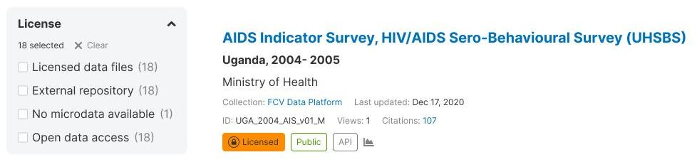
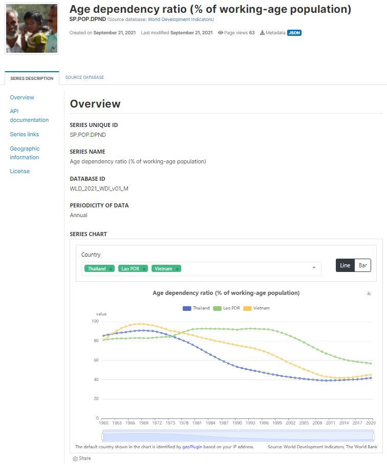

# The features of a modern data dissemination platform {#chapter02}

In the introductory section of this Guide, we proposed that modern data dissemination platforms should be modeled after the most successful e-commerce platforms. These platforms are optimized to serve both buyers (in our context, the data users) and sellers (in our context, the data providers) in the most efficient manner. Internet search engines, and in particular the way they exploit the capabilities of generative artificial intelligence, are also a useful source of inspiration for the design of data catalogs. In this chapter, we outline features that a modern online data catalog should incorporate to adhere to these models.

We provide recommendations for developing data catalogs that encompass lexical search and semantic search, filtering, advanced search functionality, interactive user interfaces, and the capability to operate as useful recommender systems. We approach the topic from three distinct perspectives: the viewpoint of **data users**, who represent a highly diverse community with varying needs, preferences, expectations, and capabilities; the standpoint of **data suppliers**, who either publish their data or delegate the task to a data library; and the perspective of **catalog administrators**, responsible for curating and disseminating data in a responsible, effective, and efficient manner while optimizing both user and supplier satisfaction.

The creation of a data dissemination platform is a collaborative endeavor, engaging data curators, user experience (UX) experts, user interface (UI) designers, search and systems engineers, and subject matter specialists with a profound understanding of both the data and the users' requirements and preferences. Inclusive in this development process should be the active participation of the users, allowing them to provide feedback that directly influences the system's design.

## Features for data users 

In order to cultivate a favorable user experience, online data catalogs must offer an intuitive and efficient interface, allowing users to effortlessly access the most pertinent datasets. To meet user expectations effectively, one should emphasize **simplicity** and **relevance**. A data dissemination platform should also be made accessible free of discrimination. The Web Content Accessibility Guidelines (WCAG) international standard provides principles and recommendations for accessibility to people with disabilities. Integrating these principles into the design of data catalogs can deliver a seamless and user-friendly experience, akin to the convenience and ease provided by internet search engines and e-commerce platforms. 

Users of a data catalog will typically want to **search** and **filter** the assets available in a catalog. They will also wantto **browse** and possibly **sort** the catalog entries or the entries returned by running a search or by activating a filter. We describe below how the search, filtering, browsing, and sorting features may be designed to provide a user-friendly experience. **Other features** of a data catalog that may be useful to users are also proposed.

### Search 

Search engines implemented in data catalogs can be categorized as either *lexical* or *semantic*, or they may seamlessly integrate elements of both. A lexical search, also referred to as a keyword or full-text search, operates by matching literal terms from a user query to the search engine's index, subsequently returning datasets whose indexed metadata includes the specified terms. On the other hand, a semantic search strives to pinpoint datasets with metadata that bears semantic resemblance to the query. Ideally, a comprehensive data catalog would incorporate both lexical and semantic search engines, seamlessly blended into a unified search tool. However, the integration of semantic search functionality presents a complexity in implementation.

Semantic search leverages advanced techniques like embeddings, vector indexing, and similarity measures to enhance the precision and relevance of search results by capturing the semantic meaning of user queries and dataset content. The process typically involves converting words or phrases into high-dimensional vectors using embeddings. Embeddings are representations of words or phrases in a continuous vector space, where semantically similar terms are positioned closer to each other.

Vector indexing in specialized vector databases is a key aspect of semantic search. These databases, such as Milvus or Qadrant, are optimized for storing and querying high-dimensional vectors efficiently. They enable the indexing of embeddings associated with both user queries and catalog resources, allowing for fast and accurate similarity searches.

Cosine similarity is a common measure used in semantic search to quantify the similarity between vectors. In a vector space, the cosine of the angle between two vectors is calculated, with a higher cosine indicating greater similarity. This measure is instrumental in ranking and retrieving datasets based on their semantic relevance to a user's query.

To facilitate the implementation of semantic search, APIs play a crucial role. APIs for generating embeddings streamline the process by providing access to pre-trained models or embedding services. These APIs take care of the complex task of converting textual data into meaningful embeddings, saving time and resources for developers. Additionally, APIs for search engines allow the integration of semantic search capabilities seamlessly, enabling the retrieval of relevant results based on semantic similarity.

In a search engine, semantic search is often combined with lexical search to offer a comprehensive and effective discovery system. Lexical search involves matching literal terms in a user query to the search engine's index, while semantic search focuses on identifying datasets with semantically similar metadata. Combining these approaches ensures a balanced and robust search system, catering to a wide range of user preferences and query styles.

In summary, semantic search is a powerful approach that involves embeddings, vector indexing, and similarity measures to provide users with more contextually relevant results. Specialized vector databases, APIs for embeddings, and a combination with lexical search contribute to the seamless implementation of semantic search in data catalog search engines, enhancing the overall user experience and discovery capabilities.

For microdata: embeddings based on thematic variable groupings - an option to implement semantic search and recommendations
Discovery of microdata poses specific challenges. Typically, a data dictionary will be available, with variables organized by data file. A "virtual" organization of variables by thematic group, with a pre-defined ontology, can significantly improve data discoverability. AI solutions can be used to generate such groupings and map variables to them. The DDI metadata standard provides the metadata elements needed to store information on variable groups.

What search returns: always, a list of results (list of entries) ranked by order of relevance (if none, a message "No entry match your query"). But also in some cases an answer in conversational mode (generative AI) and/or in the form of value/visualization. This will be only when the query justifies it. The system must be able to find out if such an immedate answer is appropriate. 

#### Search box

In a data catalog, the primary means of searching for data is typically through a single, intuitive search box. Recognizing the diversity in users' search capabilities, the search engine must be designed to accommodate a range of query inputs, acknowledging that not all users will craft perfect queries. 

To enhance user experience and overcome potential spelling errors, the search engine may leverage advanced indexing tools such as Solr or ElasticSearch. Additionally, users should have the flexibility to input queries either through traditional keyboard entry or via audio commands.

 

 

Ensuring a nuanced understanding of user queries, the search engine should employ sophisticated processes, including automated query parsing and enhancement. This parsing mechanism extracts crucial information from the query, discerning factors such as the type of data under consideration, whether the query pertains to specific indicators within the catalog assets, references to geographic locations, time-related elements, and the suitability of a keyword search versus a semantic search. The system also endeavors to detect the language of the query and, if necessary, offers translation services.

A pivotal aspect of the search engine's functionality lies in its ability to decipher the user's intent and return results ranked by relevance. This demands an intricate analysis of the query, potentially leading to immediate answers. Depending on the nature of the query, the application must intelligently determines whether to present results in textual form, organize them in a data grid, or generate visualizations for a more comprehensive understanding. This multifaceted approach ensures that users can interact seamlessly with the data catalog, obtaining the most pertinent information in a manner that aligns with their preferences and requirements.

#### Document as a query

A search engine equipped with semantic search capabilities extends its user-friendly functionality by accommodating queries of varying lengths, including the innovative option for users to submit entire documents—whether in PDF or TXT format—as queries. Upon receiving a document query, the search engine initiates a sophisticated process wherein it meticulously analyzes the semantic content within the document. This involves transforming the document into an embedding vector, a compact representation capturing its semantic essence. Subsequently, the search engine adeptly identifies and retrieves the most relevant resources from the catalog, ensuring a nuanced and contextually rich response to the user's document-based query.

 

 

#### Image as a query

A cutting-edge search engine, empowered with advanced image search capabilities, introduces an innovative dimension to user interaction by enabling the submission of images as queries. Users can seamlessly upload images in various formats, unlocking a novel means of exploration. Upon receiving an image query, the search engine embarks on a sophisticated journey, meticulously analyzing the visual content embedded in the image. Through intricate processes such as feature extraction and image embedding, the search engine translates the visual information into a compact and meaningful representation. Leveraging this representation, the search engine then identifies and retrieves the most pertinent resources from the catalog, delivering a tailored and visually aligned response to the user's image-based query. This transformative capability enhances the search experience, allowing users to explore and discover relevant content through the lens of visual input.

#### Suggested queries

Contemporary search engines can further enrich the user experience by the proactive generation of pertinent and refined query suggestions. Beyond merely processing user queries, these advanced search engines leverage sophisticated techniques to automatically propose alternative queries that are more useful and relevant. This intelligent feature is often implemented through the utilization of expansive graphs of related words, crafted by state-of-the-art Natural Language Processing (NLP) models. By tapping into the inherent semantic relationships between words, these graphs offer a comprehensive understanding of language nuances.

To implement such dynamic query suggestions, seamless integration with an API becomes imperative. This API facilitates the retrieval of insightful keyword recommendations grounded in the intricate web of semantic connections identified by NLP models. Users benefit from a fluid and intuitive search experience as the search engine anticipates their needs and refines their queries in real-time. This proactive query suggestion mechanism stands as a testament to the evolving landscape of search technology, where the fusion of NLP and intelligent algorithms empowers users with not only accurate search results but also a collaborative and responsive search process.

 

{width=100%}

 

A search interface could retrieve such information via API and display it as follows:

 

{width=100%}

 

#### Advanced search 

Advanced search are enabled by structured metadata, i.e., by the use of metadata standards and schemas. Accessible through an intuitive user interface, an *advanced search* option provides users with a dynamic and interactive platform to specify their search criteria. Users can pinpoint their focus to distinct metadata fields, enabling a fine-grained exploration of datasets within the catalog. Furthermore, to cater to users familiar with syntax-based queries, the Advanced Search offers a syntax option, granting more adept users the flexibility to craft complex search queries using boolean operators.

Whether through the user-friendly interface or the syntax option, the Advanced Search capability provides a comprehensive and tailored search experience. This feature not only acknowledges the diverse needs of users but also reflects the catalog's ability to facilitating efficient and precise data discovery through the judicious use of structured metadata.

 

{width=85%}

 

This would correspond to the following syntax that the user could enter directly in the search box (and save and/or share with others):
 

**title:"demographic transition" AND country:(*Kenya*) AND body:(poverty)**

 

#### Geographic search

Geographic discoverability and searchability within data catalogs are critical components that cater to the diverse needs of users seeking information pertaining to specific geographic areas. Data catalogs routinely receive a substantial volume of queries centered around particular regions, whether at the country level, sub-national entities, or non-administrative geographic features like watersheds and oceans. In the context of data catalogs housing geographic datasets, it becomes imperative to offer specialized search tools that enhance the precision and relevance of spatial data discovery.

While metadata standards often allow the utilization of bounding boxes to specify geographic coverage, this method has inherent limitations that make it imperfect. Drawing a box on a map to define an area oversimplifies the complexity of geographical features, particularly when users are interested in irregular or non-standard shapes. To address this limitation, it is recommended to incorporate advanced geographic search tools that provide users with more nuanced ways to explore datasets based on their spatial characteristics.

Geographic indexing emerges as a powerful solution for datasets with explicit geographic content. The H3 index, known for its hierarchical hexagonal structure, proves to be a robust option. The hierarchical nature of the H3 index facilitates efficient aggregation and retrieval of data at various levels of granularity, offering an effective means to enhance the geographic discoverability of datasets within a catalog. By adopting geographic indexing, the catalog ensures that users can precisely identify and access datasets relevant to their spatial requirements.

Recognizing that many users rely on keyword searches to discover data, it is also essential to address the challenges associated with incomplete metadata coverage. For instance, a raster image of the Philippines obtained from satellite imagery may contain the country name in its metadata. Still, specific sub-national areas like "Iloilo" may not be explicitly mentioned. To overcome this limitation, a sophisticated search engine should implement intelligent query parsing. This involves detecting if a user query contains the name of a geographic area, automatically identifying the corresponding polygon of geographic coordinates. This process can be facilitated by leveraging APIs such as Nominatim. Subsequently, the search engine retrieves relevant resources in the catalog that cover the specified geographic area, underscoring the importance of geographically indexing datasets to enable accurate and comprehensive results.

This integrated approach ensures that users can seamlessly navigate and explore geographic datasets within the catalog, whether through advanced search tools, geographic indexing, or intelligent keyword parsing, thereby fostering a robust and user-centric data discovery experience.

 

 

Example of use of Nominatim: The Nominatim application shows the polygon boundary for the search query “Iloilo City” automatically provided by the API.

 

 

The search API endpoint of Nominatim returns this JSON data which can be processed to generate search cell(s).

 

 

#### Ranking results 

A search engine must not only identify relevant datasets but also present them in an ordered list based on their level of relevance. The ranking of results directly influences users' ability to quickly find pertinent information, with the most relevant outcomes prominently positioned at the top. If users do not encounter relevance in the initial results, there's a risk of them seeking data from alternative sources, emphasizing the critical role of effective result ranking in user satisfaction and retention.

Achieving optimal result ranking hinges on the careful consideration of both the content and structure of metadata. Relevance engineering plays a pivotal role in this process, requiring fine-tuning of advanced search tools such as Solr or ElasticSearch. This is a crucial step in ensuring that the search engine not only identifies relevant datasets but also presents them in a manner that aligns with users' expectations.

Optimizing keyword-based searches is integral to effective result ranking. While out-of-the-box solutions like those provided by SQL databases may fall short, advanced indexing tools such as Solr and ElasticSearch offer robust mechanisms for enhancement. Structured metadata proves to be a key ally in this optimization effort, enabling the boosting of specific metadata elements. For instance, a query term found in the title holds greater weight than if found in notes, and results are ranked accordingly. Similarly, attributing more weight to a country name found in designated metadata elements like nation or reference country ensures that results align with the contextual relevance of the query.

Furthermore, advanced indexing tools provide additional functionalities, including grouping, sequencing, and proximity-based considerations, further refining the result ranking process. The boosting capabilities offered by tools like Solr and ElasticSearch empower search engines to adapt and align with the nuanced preferences of users, ultimately contributing to an enhanced and efficient data discovery experience.

For large data catalogs managed by well-resourced agencies, the exploration of machine learning solutions, particularly "learn-to-rank" techniques, offers an avenue for result ranking enhancement. This involves leveraging the expertise of data scientists to develop models that can intelligently weigh and prioritize results based on relevance, contributing to an improved and personalized user experience. 

#### Saving and sharing results

Empowering users with the ability to save, export, and share their search queries within a data catalog search engine enhances the overall utility and collaborative potential of the platform. The option to save a search query for future re-use provides users with a convenient way to revisit and refine their information retrieval strategies. This is particularly beneficial for users engaging in recurrent or complex data exploration, allowing them to streamline their workflow and save time.

The capability to export search results is equally crucial, offering users the flexibility to analyze and manipulate the obtained data outside the confines of the search engine. Exported results, whether in the form of downloadable files or accessible URLs, enable seamless integration with external tools and applications for further analysis or visualization.

Sharing functionalities contribute to the collaborative aspect of data exploration. Enabling users to share both their saved queries and the results with others fosters knowledge exchange and collaboration within the user community. The option to share via social media platforms adds an additional layer of accessibility, allowing users to disseminate valuable insights to a broader audience and potentially connect with others who share similar interests or objectives.

In essence, the ability to save, export, and share search queries and results not only enhances the individual user experience by facilitating efficient workflow management but also promotes collaboration, knowledge-sharing, and community engagement within the data catalog ecosystem. This collaborative dimension contributes to the creation of a more dynamic and interactive user community, fostering a culture of shared insights and collective learning.

### Filtering

Applies to full catalog (window shopping) or results from a search.

Facets or filters are useful for narrowing down datasets based on specific metadata categories. For instance, in a data catalog with datasets from different countries, a "country" facet can help users find relevant datasets quickly. To be effective, filters must be based on metadata elements that have a limited number of categories and a predictable set of options. Controlled vocabularies can be used to enable such filters. Furthermore, as some metadata elements are specific to particular data types, contextual facets should be integrated into the catalog's user interface to offer relevant filters based on the type of data being searched.

{width=100%}

 

Tags and tag groups (which are available in all schemas we recommend) provide much flexibility to implement facets, as we showed in section 1.7. 

The user interface should make it clear when entries are filtered, possibly by showing pills that can be de-activated.

#### Organizing entries by collections

Catalogs that contain many entries may organize such entries by *collection*. The collections may be thematic or other (for example, entries may be organized by origin of the data, geographic coverage, or other criteria). Collections are virtual; a same entry may belong to more than one collection. A brief description of each collection, and a "filter by collection", should be provided.

#### Organizing entries by data type

When a data catalog contains multiple types of data, it should offer an easy way for users to filter and display query results by data type. For example, when searching for "US population," one user may only be interested in knowing the total population of the USA, while another may need the public use census microdata sample, and a third may be searching for a publication. To cater to such needs, presenting query results in type-specific tabs (with an "All" option) and/or providing a filter (facet) by type will allow users to focus on the types of data relevant to them. This is similar to commercial platforms that offer search results organized by department, allowing users to search for "keyboard" in either the "music" or "electronics" department.

{width=100%}

 

#### Transparency in access policies

The terms of use (ideally provided in the form of a standard license) and the conditions of access to data should be made transparent and visible in the data catalog. The access policy will preferably be provided using a controlled vocabulary, which can be used to enable a facet (filter) as shown in the screenshot below.

{width=100%}

 

#### Other facets

Structured metadata enables it
Tags and tag groups

### Browsing

#### Providing core information in the entry list page

The list of entries that the users will browse should provide the core information on each entry in a *card*. The user who browses the catalog should not have to open a new page to obtain the most important information such as the title, year, author/producer, and other key information about the entry.

#### Highlights and most popular entries

Some catalog entries may be highlighted in the catalog, and the most popular entries my be listed in the catalog's home page.

#### Recent additions and history

Some users may be interested in finding out what new entries are available in the catalog. The catalog should provide a list of the most recent additions, and a history of additions and updates. The entries in the catalog should be sortable by the date the entry was added or last modified.

 

 

#### Metadata display and formats

To make metadata easily accessible to users, it's important to display it in a convenient way. The display of metadata will vary depending on the data type being used, as each type uses a specific metadata schema. For online catalogs, style sheets can be utilized to control the appearance of the HTML pages.

In addition to being displayed in HTML format, metadata should be available as electronic files in JSON, XML, and potentially PDF format. Structured metadata provides greater control and flexibility to automatically generate JSON and XML files, as well as format and create PDF outputs. It's important that the JSON and XML files generated by the data catalog comply with the underlying metadata schema and are properly validated. This ensures that the metadata files can be easily and reliably reused and repurposed.

{width=100%}

 

#### Variable-level comparison

E-commerce platforms commonly allow customers to compare products by displaying their pictures and descriptions (i.e., metadata) side-by-side. Similarly, for data users, the ability to compare datasets can be valuable to evaluate the consistency or comparability of a variable or an indicator over time or across sources and countries. However, to implement this functionality, detailed and structured metadata at the variable level are necessary. These metadata standards, such as DDI and ISO 19110/19139, enable the implementation of this feature. 

In the example below, we show how a query for *water* returns not only a list of seven datasets, but also a list of variables in each dataset that match the query.

{width=100%}

 

The *variable view* shows that a total of 90 variables match the searched keyword.

{width=100%}

 

After selecting the variables of interest, users should be able to display their metadata in a format that facilitates comparison. The availability of detailed metadata is crucial to ensure the quality and usefulness of these comparisons. For example, when working with a survey dataset, capturing information on the variable universe, categories, questions, interviewer instructions, and summary statistics would be ideal. This comprehensive metadata will enable users to make informed decisions about which variables to use and how to analyze them.

{width=100%}

 

#### Image mosaic view

#### Data preview

When the data (time series and tabular data, possibly also microdata) are made available via API, the data catalog can also provide a data preview option, and possibly a data extraction option, to the users. Multiple JavaScript tools, some of them open-source, are available to easily embed data grids in catalog pages.

{width=80%}

For a document, the "data preview" would consist of a document viewer that would allow the user to view the document within the application (even when the document is not stored in the catalog itself but in an external website). When implementing such a feature, check that the terms of use of the origination source allows that.

 

 

#### Visualizations

Embedding visualizations in a data catalog can greatly enhance its usefulness. Different types of data require different types of visualizations. For instance, time series data can be effectively displayed using a line chart, while images with geographic information can be displayed on a map that shows the location of the image capture. For more complex data, other types of charts can be created as well. However, in order to embed dynamic charts in a catalog page, the data needs to be available via API. A good data catalog should offer flexibility in the types of charts and maps that can be embedded in a metadata page. For instance, the NADA catalog provides catalog administrators with the ability to create visualizations using various tools. By including visualizations in a data catalog, users are able to quickly and easily understand the data and gain insights from it.

The NADA catalog allows catalog adinistrators to generate such visualizations using different tools of their choice. The example below were generated using the open-source [Apache eCharts](https://echarts.apache.org/en/index.html) library.

 
*Example: Line chart for a time series*

{width=100%}

 
*Example: Geo-location of an image*

{width=100%}

 

#### Embedded videos

#### Information on API access

#### Showing links 

Not all data catalog users know exactly what they are looking for and may need to explore the catalog to find relevant resources. E-commerce platforms use recommender systems to suggest products to customers, and data catalogs should have a similar commitment to bringing relevant resources to users' attention. To achieve this, modern data catalogs display relationships between entries, which may involve data of different types, such as microdata files, analytical scripts, and working papers.

These relationships can be documented in the metadata, such as identifying datasets as part of a series or new versions of a previous dataset. When relationships are not known or documented, machine learning tools such as topic models and word embedding models can be used to establish the topical or semantic closeness between resources of different types. This can be used to implement a recommender system in data catalogs, which automatically identifies and displays related documents and data for a given resource. The image below shows how "related documents" and "related data" can be automatically identified and displayed for a resource (in this case a document).

{width=100%}

 

#### Related entries (recommendations)

### Sorting 

The entries displayed in the user interface must be sortable by some key features, including the title of the entry, the year, the date the entry was added or last modified, the geographic area, and possibly others. To make filters operate properly, the use of controlled vocabulary may be required for some metadata fields, such as the geographic coverage of the data. The country names, for example, should be consistent across the catalog (the Democratic Republic of Congo should not be named "Democratic Republic of Congo" in some cases and "Congo, Democratic Republic" in others). 

### Other features for users

#### Data and metadata API

To keep up with modern data management needs, a comprehensive data catalog must provide users with convenient access to both data and metadata through an application programming interface (API). The structured metadata in a catalog allows users to extract specific components of the metadata they need, such as the identifier and title of all microdata and geographic datasets conducted after a certain year. With an API, users can easily and automatically access datasets or subsets of datasets they require. This enables internal features of the catalog such as dynamic visualizations and data previews, making data management more efficient. It is crucial that detailed documentation and guidelines on the use of the data and metadata API are provided to users to maximize the benefits of this feature.

Metadata (and data) should be accessible via API
If data accesisble via API, make it clear (and filter)
The API should be well documented with examples.
API query builder: UI for building an API query
Limitations as required (API key; permission system; monitoring; security) 

#### Bulk download option

Even when UI or visualizations etc are shown, many users just want to downlaod the data and metadata.
(...)

#### Alerts (notifications)

Users may want to be automatically notified (by email) when new entries of interest are added, or when change are made to a specific resource. A system allowing users to set criteria for automatic notification can be developed.

Example of Google SCholar alerts:

 

 

#### Time series query user interface

For time series only

#### Data and metadata as a service

- Maintain a data service: let external users build dashboards/platorms dynamically connected via API; one organization cannot customize to all communities of users.

Build your own dashboards
- Allow users to set preferences: thematic, data type, geographies, search query
- Have a page where pre-designed dashboards (country/thematic pages) and custom dashboard are accessible
- Allow sharing of dashboards
- Core idea: all data and metadata accessible via API; platform operates as a service to feed dashboards (within the platform or external) 

#### Online data access forms 

Make the process of registration, requests fully digital, easy, and fully traceable.

#### Permanent URLs 

To ensure efficient management and organization of datasets within a data catalog, it is essential to assign a unique identifier to each dataset. This identifier should not only meet technical requirements but also serve other purposes such as facilitating dataset citation. To achieve maximum effectiveness, it is recommended that datasets have a globally unique identifier, which can be accomplished through the assignment of a Digital Object Identifier (DOI). DOIs can be generated in addition to a catalog-specific unique identifier and provide a permanent and persistent identifier for the dataset. For more information about the process of generating DOIs and the reasons to use them, visit the [DataCite website](https://datacite.org/).   

Include a citation requirement in metadata.

#### Archive / tombstone

When a dataset is removed or replaced, the reproducibility of some analysis may become impossible. This may be a problem for some users. Unless there is a reason for not making them accessible, old versions of datasets should be kept accessible. But they should not be the ones indexed and dislayed in the catalog, to avoid cnfusion or the risk that a user would exploit a version other than the latest. Moving datasts that are replaced to an archive section of the catalog (not indexed) is an option. Note that DOIs require a permanent web page.

#### Catalog of citations

A data catalog should not be limited to data. Ideally, the scripts produced by researchers to analyze the data, and the output of their analysis, should also be available. An ideal data catalog will allow a user to:

- search for data, and find/access the related scripts and citations
- search for a document (analytical output), and find/access the related data and scripts
- search for a script, and find/access the data and analytical output

Maintain a catalog of citations of datasets. 

 

 

#### Reproducible and replicable scripts

Document, catalog, and publish reproducible/replicable scripts.

 

 

#### Users' feedback

Feedback on catalog certainly. In the form of a "Contact" email and possibly a "feedback form". Also, if the platform itself is open source, GitHub for issues and suggestions on the application itself.

BUT: Users forum, "reviews" as in e-commerce platforms, is not always recommended. Not all users are 'constructive" and qualified. Requires moderation, which can be costly and controversial. May create dis-incentives for data producers to publish their data. Could be a good option for data platforms that are internal to an organization (where comments are attributed, and an authentication system controls who can provide feedback), but not for public data platforms.

#### Support

Contact, responsive
FAQs

#### Interaction with resource

Generative AI

#### AI-activated assistance to data analysis 

Writing scripts; copilot

## Features for data providers 

When the data catalog is not administered by the producer of the data but by an entrusted repository, data providers want:

### Safety

- Safety, protection against reputation risk (responsible use of data)
- Guarantee that regulations and terms of use will be strictly complied with; reputation of the organization that manages the catalog (Seal of Approval or other accreditation; properly staffed)

### Visibility

- Visibility to maximize the use of data (including options to share/publicize on social media) - screenshot from data.gov

 

 

### Efficiency

"do not disturb": low burden of deposit and no burden of serving users (minimum interaction with users; providing detailed metadata helps)

### Information on usage

Monitoring of usage (downloads and citations) to assess demand; reports on this (automatically generated)
API and downloads etc

### Feedback from users

Feedback on quality issues

## Features for catalog administrators

In addition to meeting the needs of its users, a modern data catalog should also offer features that a catalog administrator can appreciate or expect. The features listed below can serve as checklist for choice of an application or development of features. These features may include:

### Data deposit

User friendly interface for data deposit. Compliant with metadata stadards. With embedded quality gateways and clearance procedures.

### Privacy protection

Tools for privacy protection control (e.g., tools to identify direct identifiers)

### Free software

Availability of the application as an open-source software, accompanied by detailed technical documentation

### Security

Robust security measures, such as compatibility with advanced authentication systems, flexible role/profile definitions, regular upgrades and security patches, and accreditation by information security experts

### IT affordability

Reasonable IT requirements, such as shared server operability and sufficient memory capacity

### Ease of maintenance

Ease of upgrading to the latest version

###  Interoperability 

Interoperability with other catalogs and applications, as well as compliance with metadata standards. By publishing metadata across multiple catalogs and hubs, data visibility can be increased, and the service provided to users can be maximized. This requires automation to ensure proper synchronization between catalogs (with only one catalog serving as the "owner" of a dataset), which necessitates interoperability between the catalogs, enabled by compliance with common formats and metadata standards and schemas.

### Flexibility on access policies

Flexibility in implementing data access policies that conform to the specific procedures and protocols of the organization managing the catalog.
Both for downloads, browsing (data preview), and API access 

### API based system for automation and efficiency

Availability of APIs for catalog administration
Easy automation of procedures (harvesting, migration of formats, editing, etc.) This means API-based system.

### Featuring tools

Ability to feature datasets

### Usage monitoring and analytics

Easy activation of usage analytics (using Google Analytics, Omniture, or other)

### Multilingual capability

Multilingual capability, including internationalization of the code and the option for catalog administrators to translate or adapt software translations

### Embedded SEO

Embedded Search Engine Optimization (SEO) procedures

### Widgets and plugins

Ability to use widgets to embed custom charts, maps, and data grids in the catalog

### Feedback to developers

Ability to provide feedback and suggestions to the application developers.
   
 
## Machine learning for a better user experience

In Chapter 1, we emphasized the importance of generating comprehensive metadata and how machine learning can be leveraged to enrich it. Natural language processing (NLP) tools and models, in particular, have been employed to enhance the performance of search engines. By utilizing machine learning models, semantic search engines and recommender systems can be developed to aid users in locating relevant data. Moreover, machine learning can improve the ranking of search results to ensure that the most pertinent results are brought to users' attention. Google, Bing, and other leading search engines have employed machine learning for years. While specialized data catalogs may not have the resources to implement such advanced systems, catalog administrators should explore opportunities to utilize machine learning to enhance their users' experience. Catalogs can make use of external APIs to exploit machine learning solutions without requiring administrators to develop machine learning expertise or train their own models. For instance, APIs can be used to automatically and instantly translate queries or convert queries into embeddings. Ideally, a global community of practice will develop such APIs, including training NLP models, and provide them as a global public good.  

### Improved discoverability

In 2019, Google introduced their NLP model, BERT (Biderectional Encoder Representations from Transformers), as a component of their search engine. Other major companies, such as Amazon, Apple, and Microsoft, are also developing similar models to enhance their search engines. One of the objectives of these companies is to create search engines that can support digital assistants like Siri, Alexa, Cortana, and Hey Google, which operate on a conversational mode and provide answers to users rather than just links to resources. Improving NLP models is a continuous and strategic priority for these companies, as not all answers can be found in textual resources. Google is also conducting research to develop solutions for extracting answers from tabular data.

Specialized data catalogs maintained by data centers, statistical agencies, and other data producers still rely almost exclusively on full-text search engines. The search engine within these catalogs looks for matches between keywords submitted by the user and keywords found in an index, without attempting to understand or improve the user's query. This can result in issues such as misinterpretation of the query, as discussed in Chapter 1, where a search for "dutch disease" may be mistakenly interpreted as a health-related query rather than an economic concept.

The administrators of these specialized data catalogs often lack the resources to develop and implement the most advanced NLP solutions, and should not be required to do so. To assist them in transitioning from keyword-based search systems to semantic search and recommender systems, open solutions should be developed and published, such as pre-trained NLP models, open source tools, and open APIs. This would necessitate the creation and publishing of global public goods, including specialized corpora and the training of embedding models on these corpora, open NLP models and APIs that data catalogs can utilize to generate embeddings for their metadata, query parsers that can automatically improve/optimize queries and convert them into numeric vectors, and guidelines for implementing semantic search and recommender systems using tools like Solr, ElasticSearch, and Milvus.

Simple models created from open source tools and publicly-available documents can provide straightforward solutions. In the example below, we demonstrate how these models can "understand" the concept of "dutch disease" and correctly associate it with relevant economic concepts.

 

{width=100%}

 

### Improved results ranking

Effective search engines not only identify relevant resources, but also rank and present them to users in an optimal order of relevance. As highlighted in Chapter 1, [research](https://www.webfx.com/internet-marketing/seo-statistics.html) shows that 75% of search engine users do not click past the first page, emphasizing the importance of ranking and presenting results effectively.

Data catalog administrators face two challenges in improving their search engine performance. Firstly, they need to improve their ranking in search engines such as Google by enriching metadata and embedding metadata compliant with DCAT or schema.org standards on catalog pages. Secondly, they need to improve the ranking of results returned by their own search engines in response to user queries.

Google's success in 1996 was largely attributed to their revolutionary approach to ranking search results called *PageRank*. Since then, they and other leading search engines have invested heavily in improving ranking methodologies with advanced techniques like *RankBrain* (introduced in 2015). These approaches include primary, contextual, and user-specific ranking, which utilize machine learning models referred to as Learn to Rank models. [Lucidworks](https://lucidworks.com/post/abcs-learning-to-rank/) provides a clear description of this approach, noting that "Learning to rank (LTR) is a class of algorithmic techniques that apply supervised machine learning to solve ranking problems in search relevancy. In other words, it’s what orders query results. Done well, you have happy employees and customers; done poorly, at best you have frustrations, and worse, they will never return. To perform learning to rank you need access to training data, user behaviors, user profiles, and a powerful search engine such as SOLR. The training data for a learning to rank model consists of a list of results for a query and a relevance rating for each of those results with respect to the query. Data scientists create this training data by examining results and deciding to include or exclude each result from the data set."

Implementing Learn to Rank models can be challenging for data catalog administrators due to the resource-intensive nature of building the training dataset, fitting models, and implementing them. An alternative solution is to optimize the implementation of Solr or ElasticSearch, which can often contribute significantly to improving the ranking of search results. For more information on the challenge and available tools and methods for relevancy engineering, refer to D. Turnbull and J. Berryman's 2016 publication.

 

{width=100%}

 

