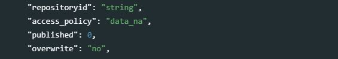
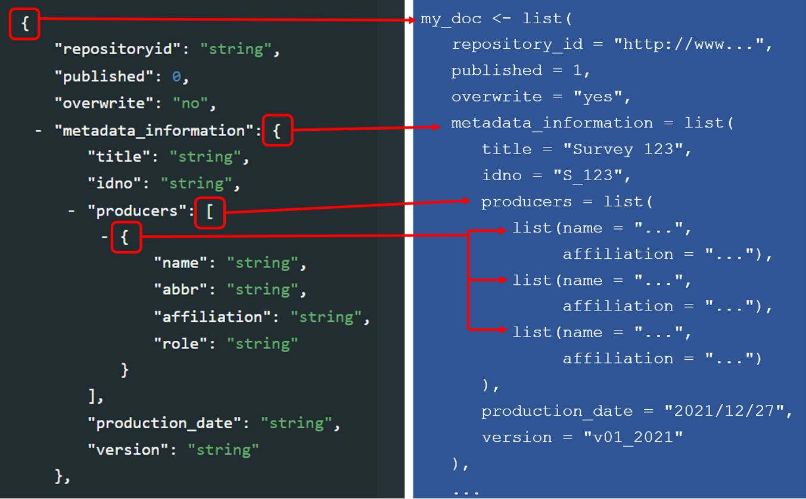

# (PART) PRACTICAL IMPLEMENTATION {-}

# Generating and publishing structured metadata {#chapter04}

Metadata conforming to the standards outlined in this Guide can be produced through two distinct methods: **utilizing a specialized metadata editor** application or **programmatically** using programming languages such as R or Python.

A **metadata editor** serves as dedicated software crafted to provide a user-friendly means of generating structured metadata. This option is particularly advantageous for users unfamiliar with programming languages and for certain data types, such as microdata.

On the other hand, the **programmatic approach** offers heightened flexibility and efficiency but necessitates a proficient understanding of R or Python. It presents opportunities to automate segments of the metadata generation process and to leverage advanced machine learning solutions for automatic metadata enhancement. Consequently, the programmatic alternative may be preferable for organizations equipped with expertise in R or Python. 

In this section, we provide a concise overview of how structured metadata can be generated and published using a metadata editor application, and using R or Python, respectively. Examples of the use of the programmatic option are also provided in chapters 5 to 13. 

This section refers to two distinct applications: the World Bank's Metadata Editor and the NADA cataloging application. Both applications are accessible freely and openly. While other metadata editors and online cataloging tools are available, none encompass all the standards outlined in the Guide. The World Bank's Metadata Editor produces metadata in open formats, such as XML and JSON, making it compatible with cataloging tools beyond NADA—such as CKAN, which can ingest the generated metadata through the application's API, for instance.

## Core properties and features of metadata elements

A metadata standard constitutes a systematic arrangement of elements crafted for documenting a dataset, complete with rules and instructions to ensure consistent and uniform implementation. These elements possess specific attributes such as name, type, description, and other predefined features, aiming to store all metadata related to a digital resource in a standardized and structured manner. The metadata standards are defined as JSON or XML schemas, rendering them machine-readable and conveniently exploitable by software applications.

The elements outlined in a metadata standard exhibit the following characteristics:

- **Simple or composite**: Simple elements consist of a single field, exemplified by the `title` element in the metadata standard used for documenting microdata. In contrast, composite elements encompass sub-elements. For instance, the `producers` element in the same standard contains sub-elements like `name`, `abbr`, `affiliation`, and `role` to capture diverse pieces of information related to the producer.

- **Optional or required**: When an element is marked as required, the metadata is considered invalid if it lacks information for that specific element. To maintain flexibility in schemas, only a few elements are set as required. Notably, a composite metadata element can be marked as required while only having optional sub-elements. Alternatively, an element may be declared optional but have one or more of its sub-elements declared as required, signifying that if the element is utilized, specific sub-elements must be provided.

- **Repeatable or Not repeatable**: For instance, the `producers` element in the microdata documentation standard is Repeatable because a dataset may be produced by multiple entities, while the `title` element is Not repeatable as a dataset should be identified by a unique official title.

- **Type**: The type denotes the format of the information contained in an element (or sub-element) and can be a string (text), a numeric value, a boolean variable (TRUE/FALSE), or an array (for composite elements).

Certain standards may suggest controlled vocabularies for specific elements, representing pre-defined sets of valid entries. However, in most cases, controlled vocabularies are not intrinsic to the metadata standard itself, as they may be organization-specific. These vocabularies can be provided and activated in the Metadata Editor using custom templates (refer to section 4.3.1).

## Documentation of the standards' API

Users opting for the programmatic route should have access to the comprehensive documentation of the standards' API. The most recent documentation of all schemas described in the Guide is available on-line at https://ihsn.github.io/nada-api-redoc/catalog-admin/#. 

<center>
{width=100%}
</center>
<br>

The left navigation bar lists the metadata standards for each data type: documents, microdata (labeled "surveys"), geospatial, database, indicators (labeled "timeseries"), tables, images, videos, research projects and reproducible scripts (labeled "scripts), and related resources (labeled "external resources"). The list also includes the following components: 

- API keys
- Collections
- Datasets
- Visualizations
- Citations
- Filestore
- Reports
- Widgets

[to be described or removed]

The righthandside frame lists all elements in a succint presentation of all elements in the standard. Curly brackets are used to group elements. In this list, we can identify the type of element and distinguish repeatable and non-repeatable elements. Repeatable elements are included into square brackets. For example, the DDI metadata standard used to document microdata contains a group of elements labeled `study_desc`, which contains a group labeled `title_statement`, in which we find (among others) a non-repeatable element `idno` (of type *string*) and a repeatable group of elements labeled `identifiers` which contains two sub-elements (`type` and `identifier`), both of them of type *string*. The grouping of elements, and the distinction between repeatable and non-repeatable elements of groups of elements, is essential when using R or Python for generating metadata.

<center>
{width=60%}
</center>
<br>

The middle frame provides a description of the metadata elements, and will indicate elements that are required. 

<center>
{width=60%}
</center>
<br>

The list of elements for each standard starts with four common elements that are not actually part of the standard itself, but that are used to store information that will be used when the metadata are published in a NADA data catalog. If NADA is not used, these elements can be ignored. These elements will not be included when the metadata are exported to JSON or XML format.

<center>
{width=100%}
</center>
<br>

   - **`repositoryid`** identifies the collection in which the metadata will be published. 
   - **`access_policy`** determines if and how the <u>data files</u> will be accessible from the catalog in which the metadata are published. This element only applies to the microdata and geographic metadata standards. It makes use of a controlled vocabulary with the following access policy options: 
      - **`direct`**: data can be downloaded without requiring them to be registered; 
      - **`open`**: same as "direct", with an open data license attached to the dataset; 
      - **`public`**: public use files, which only require users to be registered in the catalog;
      - **`licensed`**: access to data is restricted to registered users who receive authorization to use the data, after submitting a request;
      - **`remote`**: data are made available by an external data repository;
      - **`data_na`**: data are not accessible to the public (only metadata are published). 
   - **`published`** determines the status of the metadata in the on-line catalog (with options 0 = draft and 1 = published). Published entries are visible to all visitors of the on-line catalog; unpublished (draft) entries will only be visible by the catalog administrators and reviewers. 
   - **`overwrite`** determines whether the metadata already in the catalog for this entry can be overwritten (iwith options yes or no, 'no' being the default).  

This set of administrative elements is followed by one or multiple sections that contain the elements specific to each standard. For example, the DDI Codebook metadata standard, used to document microdata, contains the following main sections:
   
   - **`document description`**: a description of the metadata (who documented the dataset, when, etc.) Most schemas will contain such a section describing the metadata, useful mainly to data curators and catalog administrators. In other schemas, this section may be named `metadata_description`. 
   - **`study description`**: the description of the survey/census/study, not including the data files and data dictionary.
   - **`file description`**: a list and description of data files associated to the study.
   - **`variable description`**: the data dictionary (description of variables).

The standard-specific sections are followed by a few other metadata elements common to most schemas. These elements are used to provide additional information useful for cataloguing and discoverability purposes. They include **tags** (which allow catalog administrators to attach tags to datasets independently of their type, which can be used as filters in the catalog), and **external resources**. 

Some standards provide the possibility for data curators to add their own metadata elements in an **additional** section. The use of additional elements should be the exception, as metadata standards are designed to provide all elements needed to fully document a data resource. 


## Generating and publishing structured metadata 

### Using the Metadata Editor

The easiest way to generate metadata compliant with the standards we describe in this Guide is to use a specialized Metadata Editor. A Metadata Editor provides a user-friendly and flexible interface to document data. Most metadata editors are specific to a certain standard. The World Bank developed an open source multi-standard Metadata Editor. We provide here a brief introduction to the World Bank Metadata Editor and to its use. For more detailed information, see the Metadata Editor User Guide.

The full version of each standard is embedded in the application. But few users will ever make use of all elements contained in a standard. And some will want to customize the instructions, labels of the metadata elements, controlled vocabularies, and instructions to curators who will enter the metadata. 

The Metadata Editor allows users to develop their own templates based on the full version of the standards. A template is a subset of the elements available in the standard/schema, where the elements can be renamed and other customization can be made (within limits, as the metadata generated must remain compliant with the standard independently of the template).  

Template manager:

<br>
<center>

</center>
<br>

Then UI with (for some types) import of data and automated generation of some metadata. This provides a convenient option especially for microdata. The system will import all available metadata from common data formats like Stata or SPSS (variable and value labels), and generate summary statistics for each variable which will be part of the metadata (such as the number of valid values for the variable, and frequencies for categorical variables). This makes the Metadata Editor an effective tool for documenting microdata, as doing the same programatically may be tedious.

<br>
<center>

</center>
<br>

(describe / provide a better example)

Once complete, the metadata can be published in a NADA catalog. [provide screenshots]

### Using R

All schemas described in the [on-line documentation](https://ihsn.github.io/nada-api-redoc/catalog-admin/#) can be used to generate compliant metadata using R scripts. Generating metadata using R will consist of producing a *list* object (itself containing lists). In the documentation of the standards and schemas, curly brackets indicate to R users that a *list* must be created to store the metadata elements. Square brackets indicate that a block of elements is repeatable, which corresponds in R to a *list of lists*. For example (using the [DOCUMENT]((https://ihsn.github.io/nada-api-redoc/catalog-admin/#operation/createDocument)) metadata schema): 

<center>
{width=100%}
</center>

:::note
The sequence in which the metadata elements are created when documenting a dataset using R or Python does not have to match the sequence in the schema documentation.
:::

Metadata compliant with a standard/schema can be generated using R, and directly uploaded in a NADA catalog without having to be saved as a JSON file. An object (a list) must be created in the R script that contains metadata compliant with the JSON schema. The example below shows how such an object is created and published in a NADA catalog. We assume here that we have a document with the following information: 

   - document unique id: *WB_10986/7710* 
   - title: *Teaching in Lao PDR*
   - authors: *Luis Benveniste, Jeffery Marshall, Lucrecia Santibañez (World Bank)*
   - date published: *2007*
   - countries: *Lao PDR*. 
   - The document is available from the World Bank Open knowledge Repository at http://hdl.handle.net/10986/7710.   

We will use the [DOCUMENT schema](https://ihsn.github.io/nada-api-redoc/catalog-admin/#tag/Documents) to document the publication, and the [EXTERNAL RESOURCE schema](https://ihsn.github.io/nada-api-redoc/catalog-admin/#tag/External-resources) to publish a link to the document in NADA.

<center>
{width=100%}
</center>
<br>

Publishing data and metadata in a NADA catalog (using R and the NADAR package or Python and the PyNADA library) requires to first identify the on-line catalog where the metadata will be published (by providing its URL in the `set_api_url` command line) and to provide a key to authenticate as a catalog administrator (in the `set_api_key` command line; note that this key should never be entered in clear in a script to avoid accidental disclosure). 

We then create an object (a list in R, or a dictionary in Python) that we will for example name *my_doc*. Within this list (or dictionary), we will enter all metadata elements. Some will be simple elements, others will be lists (or dictionaries). The first element to be included is the required `document_description`. Within it, we include the `title_statement` which is also required and contains the mandatory elements `idno` and `title` (all documents must have a unique ID number for cataloguing purpose, and a title). The list of countries that the document covers is a <u>repeatable</u> element, i.e. a list of lists (although we only have one country in this case). Information on the authors is a repeatable element, allowing us to capture the information on the three co-authors individually. 

This *my_doc* object is then published in the NADA catalog using the `add_document` function. Last, we publish (as an external resource) a link to the file, with only basic information. We do not need to document this resource in detail, as it corresponds to the metadata provided in *my_doc*. If we had a different external resource (for example an MS-Excel table that contains all tables shown in the publication), we would make use of more of the external resources metadata elements to document it. Note that instead of a URL, we could have provided a path to an electronic file (e.g., to the PDF document), in which case the file would be uploaded to the web server and made available directly from the on-line catalog. We had previously captured a screenshot of the cover page of the document to be used as thumbnail in the catalog (optional).

```{r eval=F, echo=T}
library(nadar)
# Define the NADA catalog URL and provide an API key
set_api_url("http://nada-demo.ihsn.org/index.php/api/")
set_api_key("a1b2c3d4e5")  
    # Note: an administrator API key must always be kept strictly confidential; 
    # It is good practice to read it from an external file, not to enter it in clear 
thumb  <- "C:/DOCS/teaching_lao.JPG"  # Cover page image to be used as thumbnail
# Generate and publish the metadata on the publication
doc_id <- "WB_10986/7710" 
my_doc <- list(
   document_description = list(
   
      title_statement = list(
        idno = doc_id, 
        title = "Teaching in Lao PDR"
      ),
      
      date_published = "2007",
  
      ref_country = list(
        list(name = "Lao PDR",  code = "LAO")
      ),
      
      # Authors: we only have one author, but this is a list of lists 
      # as the 'authors' element is a repeatable element in the schema
      authors = list(
        list(first_name = "Luis",     last_name = "Benveniste", affiliation = "World Bank"),
        list(first_name = "Jeffery",  last_name = "Marshall",   affiliation = "World Bank"),
        list(first_name = "Lucrecia", last_name = "Santibañez", affiliation = "World Bank")
      )
   )
)
# Publish the metadata in the central catalog 
add_document(idno = doc_id, 
             metadata = my_doc, 
             repositoryid = "central", 
             published = 1,
             thumbnail = thumb,
             overwrite = "yes")
# Add a link as an external resource of type document/analytical (doc/anl).
external_resources_add(
  title = "Teaching in Lao PDR",
  idno = doc_id,
  dctype = "doc/anl",
  file_path = "http://hdl.handle.net/10986/7710",
  overwrite = "yes"
)
```

The document is now available in the NADA catalog.

<center>
{width=100%}
</center>


### Using Python

Generating metadata using Python will consist of producing a *dictionary* object, which will itself contain lists and dictionaries. Non-repeatable metadata elements will be stored as dictionaries, and repeatable elements as lists of dictionaries. In the [metadata documentation](https://ihsn.github.io/nada-api-redoc/catalog-admin/#), curly brackets indicate that a *dictionary* must be created to store the metadata elements. Square brackets indicate that a dictionary containing dictionaries must be created. 

<center>
{width=100%}
</center>

<br>

:::idea
Dictionaries in Python are very similar to JSON schemas. When documenting a dataset, data curators who use Python can copy a schema from the ReDoc website, paste it in their script editor, then fill out the relevant metadata elements and delete the ones that are not used.
:::
  
<center>
{width=75%}
</center>

<br>

The Python equivalent of the R example we provided above is as follows:

```{python eval=F, echo=T}
import pynada as nada
# Define the NADA catalog URL and provide an API key
set_api_url("http://nada-demo.ihsn.org/index.php/api/")
set_api_key("a1b2c3d4e5")  
    # Note: an administrator API key must always be kept strictly confidential; 
    # It is good practice to read it from an external file, not to enter it in clear  
thumb  <- "C:/DOCS/teaching_lao.JPG"  # Cover page image to be used as thumbnail
# Generate and publish the metadata on the publication
doc_id = "WB_10986/7710"
document_description = {
  'title_statement': {
      'idno': "WB_10986/7710",
      'title': "Teaching in Lao PDR"
  },
  
  'date_published': "2007",
  'ref_country': [
		{'name': "Lao PDR", 'code': "Lao"}
	],
  
  # Authors: we only have one author, but this is a list of lists 
  # as the 'authors' element is a repeatable element in the schema
  'authors': [
      {'first_name': "Luis",     'last_name': "Benveniste", 'affiliation' = "World Bank"},
      {'first_name': "Jeffery",  'last_name': "Marshall",   'affiliation' = "World Bank"},
      {'first_name': "Lucrecia", 'last_name': "Santibañez", 'affiliation' = "World Bank"},
  ]
}
# Publish the metadata in the central catalog 
nada.create_document_dataset(
  dataset_id = doc_id,
  repository_id = "central",
  published = 1,
  overwrite = "yes",
  my_doc_metadata,             @@@@@@
  thumbnail_path = thumb)
# Add a link as an external resource of type document/analytical (doc/anl).
nada.add_resource(
  dataset_id = doc_id,
  dctype = "doc/anl",
  title = "Teaching in Lao PDR",
  file_path = "http://hdl.handle.net/10986/7710",
  overwrite = "yes")
```

