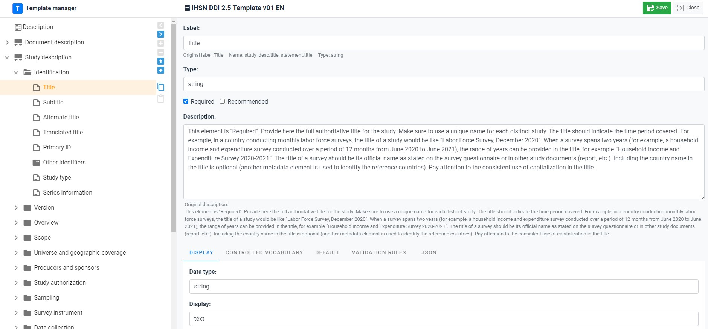
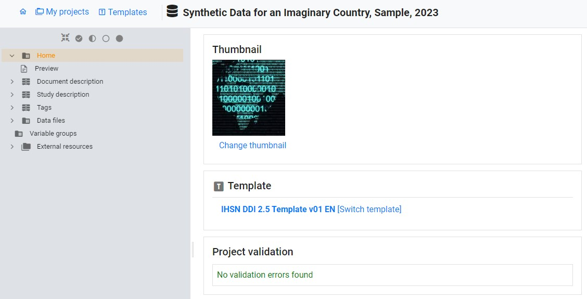
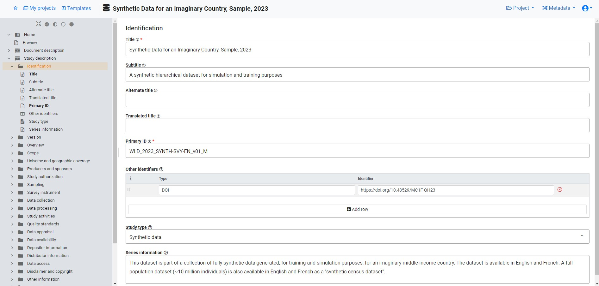
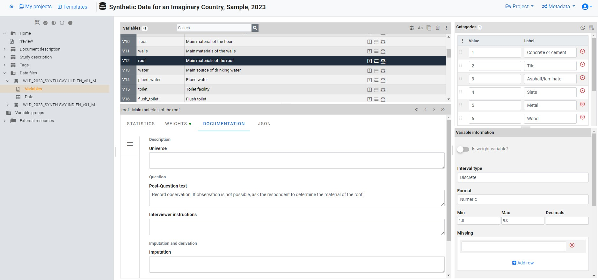
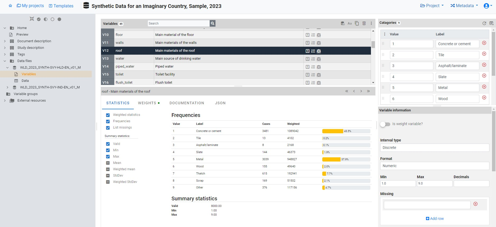
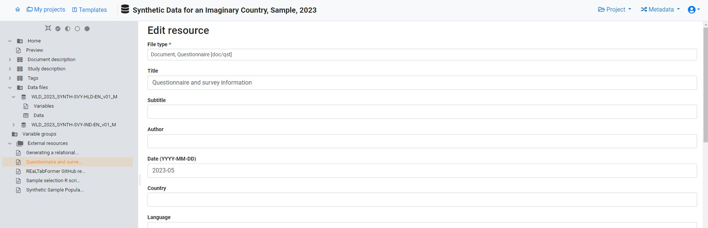
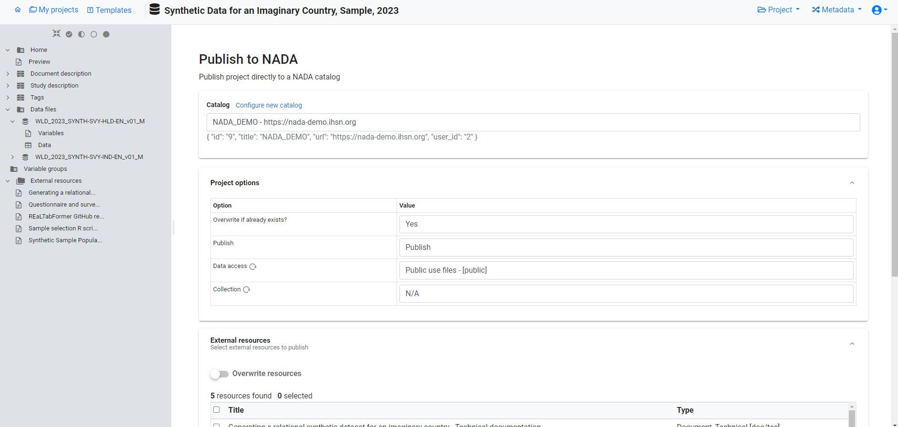
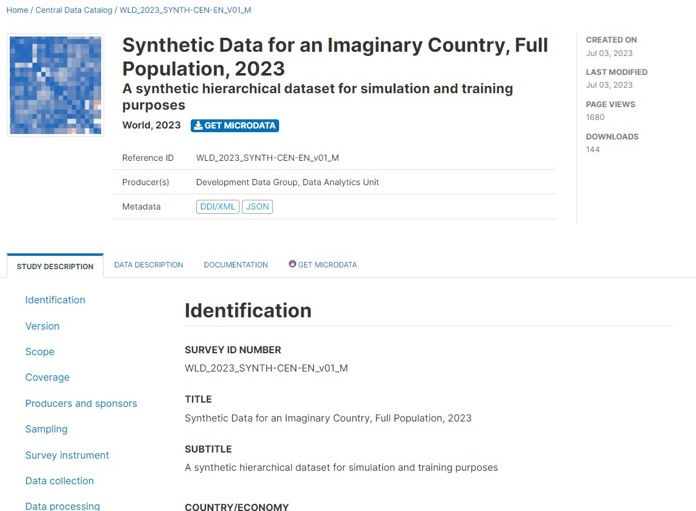
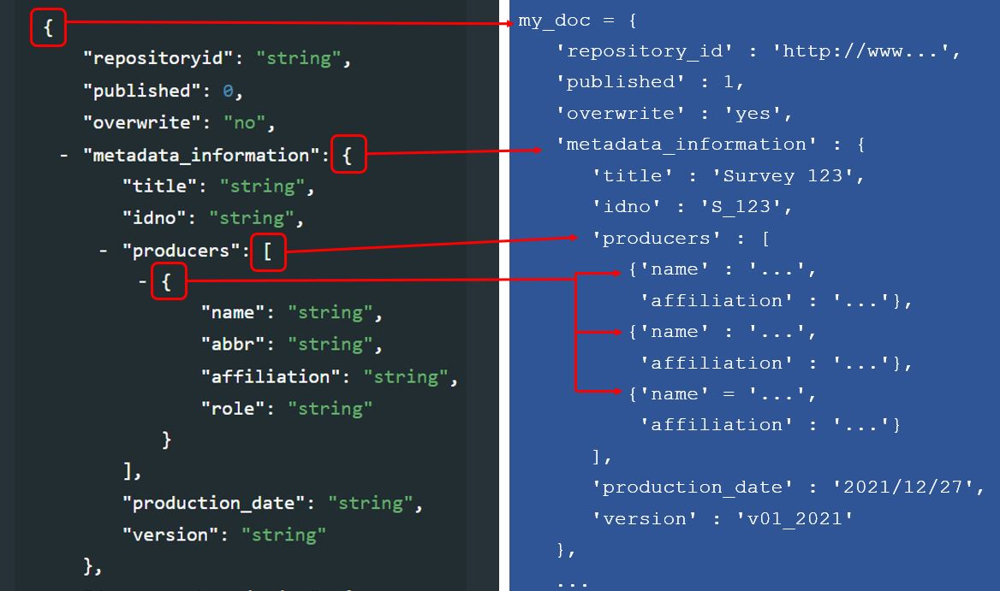

# (PART) PRACTICAL IMPLEMENTATION {-}

# Generating and publishing structured metadata {#chapter04}

Metadata conforming to the standards outlined in this Guide can be produced through two distinct methods: **utilizing a specialized metadata editor** application or **programmatically** using programming languages such as R or Python.

A **metadata editor** serves as dedicated software crafted to provide a user-friendly means of generating structured metadata. This option is particularly advantageous for users unfamiliar with programming languages and for certain data types, such as microdata.

On the other hand, the **programmatic approach** offers heightened flexibility and efficiency but necessitates a proficient understanding of R or Python. It presents opportunities to automate segments of the metadata generation process and to leverage advanced machine learning solutions for automatic metadata enhancement. Consequently, the programmatic alternative may be preferable for organizations equipped with expertise in R or Python. 

In this section, we provide a concise overview of how structured metadata can be generated and published using a metadata editor application, and using R or Python, respectively. Examples of the use of the programmatic option are also provided in chapters 5 to 13. 

This section refers to two distinct applications: the World Bank's Metadata Editor and the NADA cataloging application. Both applications are accessible freely and openly. While other metadata editors and online cataloging tools are available, none encompass all the standards outlined in the Guide. The World Bank's Metadata Editor produces metadata in open formats, such as XML and JSON, making it compatible with cataloging tools beyond NADA—such as CKAN, which can ingest the generated metadata through the application's API, for instance.


## Core properties and features of metadata elements

A metadata standard constitutes a systematic arrangement of elements crafted for documenting a dataset, complete with rules and instructions to ensure consistent and uniform implementation. These elements possess specific attributes such as name, type, description, and other predefined features, aiming to store all metadata related to a digital resource in a standardized and structured manner. The metadata standards are defined as JSON or XML schemas, rendering them machine-readable and conveniently exploitable by software applications.

The elements outlined in a metadata standard exhibit the following characteristics:

- **Simple or composite**: Simple elements consist of a single field, exemplified by the `title` element in the metadata standard used for documenting microdata. In contrast, composite elements encompass sub-elements. For instance, the `producers` element in the same standard contains sub-elements like `name`, `abbr`, `affiliation`, and `role` to capture diverse pieces of information related to the producer.

- **Optional or required**: When an element is marked as required, the metadata is considered invalid if it lacks information for that specific element. To maintain flexibility in schemas, only a few elements are set as required. Notably, a composite metadata element can be marked as required while only having optional sub-elements. Alternatively, an element may be declared optional but have one or more of its sub-elements declared as required, signifying that if the element is utilized, specific sub-elements must be provided.

- **Repeatable or Not repeatable**: For instance, the `producers` element in the microdata documentation standard is Repeatable because a dataset may be produced by multiple entities, while the `title` element is Not repeatable as a dataset should be identified by a unique official title.

- **Type**: The type denotes the format of the information contained in an element (or sub-element) and can be a string (text), a numeric value, a boolean variable (TRUE/FALSE), or an array (for composite elements).

Certain standards may suggest controlled vocabularies for specific elements, representing pre-defined sets of valid entries. However, in most cases, controlled vocabularies are not intrinsic to the metadata standard itself, as they may be organization-specific. These vocabularies can be provided and activated in the Metadata Editor using custom templates (refer to section 4.3.1).


## Documentation of the standards' API

Users opting for the programmatic route should have access to the comprehensive documentation of the standards' API. The most recent documentation of all schemas described in the Guide is available on-line at https://ihsn.github.io/nada-api-redoc/catalog-admin/#. 

<center>
{width=100%}
</center>
<br>

The navigation bar on the left of the page provides a comprehensive overview of metadata standards tailored to various data types. These include documents, microdata (labeled as "surveys"), geospatial data, databases, indicators (labeled as "timeseries"), tables, images, videos, research projects, and reproducible scripts (labeled as "scripts"). Additionally, you'll find a section dedicated to related resources (labeled as "external resources)." The list encompasses the following components: 

- API keys
- Collections
- Datasets
- Visualizations
- Citations
- Filestore
- Reports
- Widgets

[to be described or removed]

The right-hand frame presents a concise overview of all elements within the standard, employing curly brackets to logically group them. This list provides clarity on the type of each element, distinguishing between repeatable and non-repeatable ones. Repeatable elements are enclosed in square brackets. For instance, in the DDI metadata standard used for documenting microdata, there exists a group labeled `study_desc`, containing another group labeled `title_statement`. Within this structure, we encounter, among others, a non-repeatable element `idno` (of type *string*), and a repeatable group of elements labeled `identifiers`, housing two sub-elements (`type` and `identifier`), both identified as string types. Understanding the grouping and differentiation between repeatable and non-repeatable elements within these groups is pivotal, especially when utilizing R or Python for metadata generation.

<center>
{width=60%}
</center>
<br>

The central frame furnishes a detailed account of the metadata elements, highlighting those deemed **required**. 

<center>
{width=60%}
</center>
<br>

The enumeration of elements for each standard initiates with four common elements. These four elements are used to store information for eventual publication in a NADA data catalog, but are not inherent to the standard. If NADA is not employed, these elements are not used. Importantly, when the metadata undergo exportation to JSON or XML format, these particular elements are omitted from the output.

<center>
{width=100%}
</center>
<br>

These elements serve distinct functions within the system:

   - **`repositoryid`** functions to identify the collection in which the metadata will be published.

   - **`access_policy`** determines the accessibility of <u>data files</u> from the catalog in which the metadata is published. This element is applicable solely to the microdata and geographic metadata standards. It utilizes a controlled vocabulary with specific access policy options:
      - **`direct`**: Allows data to be downloaded without requiring registration.
      - **`open`**: Similar to "direct," with an open data license attached to the dataset.
      - **`public`**: Pertains to public-use files, necessitating user registration in the catalog.
      - **`licensed`**: Restricts data access to registered users who receive authorization after submitting a request.
      - **`remote`**: Makes data available through an external data repository.
      - **`data_na`**: Indicates that data are not accessible to the public, with only metadata being published.
   
   - **`published`** determines the status of metadata in the online catalog, with options 0 (draft) and 1 (published). Published entries are visible to all catalog visitors, while unpublished (draft) entries are visible solely to catalog administrators and reviewers.
   
   - **`overwrite`** dictates whether existing metadata in the catalog for a particular entry can be overwritten. It offers options of 'yes' or 'no,' with 'no' being the default.

Following this set of administrative elements, one or more sections follow, each containing elements specific to the respective standard. For instance, the DDI Codebook metadata standard, used for documenting microdata, encompasses the following primary sections:
  
   - **`document description`**: a description of the metadata (who documented the dataset, when, etc.) Most schemas will contain such a section describing the metadata, useful mainly to data curators and catalog administrators. In other schemas, this section may be named `metadata_description`. 
   
   - **`study description`**: the description of the survey/census/study, not including the data files and data dictionary.
   
   - **`file description`**: a list and description of data files associated to the study.
   
   - **`variable description`**: the data dictionary (description of variables).

Following the sections specific to each standard, there are additional metadata elements shared across most schemas. These elements play a crucial role in enhancing cataloging and discoverability. Notable among them are **tags**, empowering catalog administrators to affix tags to datasets, irrespective of their type. These tags serve as effective filters within the catalog. Another significant element is **external resources`. The standards also offer data curators the flexibility to introduce their own metadata elements within an **additional** section. The use of additional elements should be the exception rather than the rule. The design of metadata standards is intended to encompass all necessary elements for a comprehensive documentation of a data resource.


## Generating and publishing structured metadata 

### Using the Metadata Editor

To easily generate metadata aligned with the standards outlined in this guide, utilizing a dedicated Metadata Editor is highly recommended. Such tools offer a user-friendly and adaptable interface for documenting data, often tailored to specific standards. Notably, the World Bank has introduced an open-source, multi-standard Metadata Editor. Here, we present a concise introduction to the World Bank Metadata Editor and its application. For comprehensive details and instructions, please refer to the Metadata Editor User Guide.

#### Custom templates

Every standard outlined in this guide is incorporated in its entirety into the Metadata Editor. However, it is unlikely that users will utilize all elements within any given standard. Instead, they are encouraged to select a subset of elements deemed relevant for their specific purposes. Users may also wish to tailor the labels (note that the names are immutable) of metadata elements, incorporate controlled vocabularies, and customize associated instructions. This is achieved through the creation of **templates**.

Templates play a pivotal role in determining the display and content of metadata entry forms. Typically, an organization will craft a template for each pertinent standard, designating it as the "default template" in the Metadata Editor. This approach offers several advantages, including:

   - Streamlining metadata entry forms by selecting only the pertinent elements from the extensive array available in a standard or schema.
   - Designating certain elements as "required" or "recommended," surpassing the standard's own specifications.
   - Exerting control over the sequence of element appearance in metadata entry forms and grouping them according to custom criteria.
   - Tailoring labels and instructions for each metadata element to align with the terminology used by the organization's team of data curators.
   - Establishing controlled vocabularies and organization-specific default values where applicable.
   - Defining custom validation rules for the content of metadata elements in accordance with the organization's requirements.

<br>
{width=100%}
<br>

#### Producing and publishing the metadata

Illustrated below is a brief tutorial on employing the Metadata Editor to document a survey dataset (microdata) using the Data Documentation Initiative (DDI) Codebook 2.5 metadata standard. For this demonstration, we utilize a synthetic micro-dataset comprising two data files in Stata 15 format. The tutorial focuses on essential features of the Metadata Editor; for a more comprehensive understanding, consult the application's User Guide.

To document the dataset, the user will initiate the process by "Creating a new project" and opting for the "Microdata" option when prompted This action will open a new project homepage, in which the left-side navigation bar aligns with the default metadata template for "Microdata." A different template can be selected by using the "Switch template" option. The user also has the opportunity to select an image to serve as a thumbnail in the catalog where the metadata will be published. 

<br>
{width=100%}
<br>

The sections within the "Study Description" navigation bar offer access to metadata entry screens where comprehensive information about the survey can be documented.

<br>
{width=100%}
<br>

Upon completing the entry of all pertinent "Study information," the user will proceed by selecting "Data files" from the navigation bar and "Importing data", designating the two Stata data files for importation. This process will extract a comprehensive set of metadata, including variable lists, file and variable names, variable labels, and value labels. Additionally, it will generate summary statistics. Following the import, the user can enrich the metadata associated with the data files and the variables they encompass.

<br>
{width=100%}
<br>

On this page, the user can:

   - Modify variable labels.
   - Adjust value labels (specific to discrete/categorical variables).
   - Delete variables, if needed.
   - Designate a variable as a sample weight.
   - Enhance metadata for the variable (universe, literal question, interviewer instructions, derivation and imputation, etc.).
   - Specify values to be treated as "missing." 
   - Set the weighting coefficient (if applicable) for generating summary statistics.
   - Choose the summary statistics to be incorporated in the metadata under the "STATISTICS" tab.

<br>
{width=100%}
<br>

After inputting variable-level metadata for both files, the user will conclude the dataset documentation by annotating and associating external resources with the survey metadata. External resources encompass all materials intended for user access when the dataset is published in a catalog. This encompasses microdata files, whether for open dissemination or under specific restrictions. In our survey metadata instance, we will append two external resources: the Excel file housing the questionnaire and the dataset (both Stata files compressed into a zip file). To create external resources, the user can navigate to "External Resources" in the navigation tree, "Create a Resource", specify its type ("questionnaire" and "microdata" for our resources), assign a concise title to each, and provide a link to the resource or choose the file for upload in the online catalog.

<br>
{width=100%}
<br>

The dataset documentation is now complete. The metadata can be exported to JSON or XML, or published directly in a NADA catalog. 

<br>
{width=100%}
<br>

<br>
{width=100%}
<br>

### Using R

All schemas described in the [on-line documentation](https://ihsn.github.io/nada-api-redoc/catalog-admin/#) can be used to generate compliant metadata using R scripts. Generating metadata using R will consist of producing a *list* object (itself containing lists). In the documentation of the standards and schemas, curly brackets indicate to R users that a *list* must be created to store the metadata elements. Square brackets indicate that a block of elements is repeatable, which corresponds in R to a *list of lists*. For example (using the [DOCUMENT]((https://ihsn.github.io/nada-api-redoc/catalog-admin/#operation/createDocument)) metadata schema): 

<center>
{width=100%}
</center>

:::note
The sequence in which the metadata elements are created when documenting a dataset using R or Python does not have to match the sequence in the schema documentation.
:::

Metadata compliant with a standard/schema can be generated using R, and directly uploaded in a NADA catalog without having to be saved as a JSON file. An object (a list) must be created in the R script that contains metadata compliant with the JSON schema. The example below shows how such an object is created and published in a NADA catalog. We assume here that we have a document with the following information: 

   - document unique id: *WB_10986/7710* 
   - title: *Teaching in Lao PDR*
   - authors: *Luis Benveniste, Jeffery Marshall, Lucrecia Santibañez (World Bank)*
   - date published: *2007*
   - countries: *Lao PDR*. 
   - The document is available from the World Bank Open knowledge Repository at http://hdl.handle.net/10986/7710.   

We will use the [DOCUMENT schema](https://ihsn.github.io/nada-api-redoc/catalog-admin/#tag/Documents) to document the publication, and the [EXTERNAL RESOURCE schema](https://ihsn.github.io/nada-api-redoc/catalog-admin/#tag/External-resources) to publish a link to the document in NADA.

<center>
{width=100%}
</center>
<br>

Publishing data and metadata in a NADA catalog (using R and the NADAR package or Python and the PyNADA library) requires to first identify the on-line catalog where the metadata will be published (by providing its URL in the `set_api_url` command line) and to provide a key to authenticate as a catalog administrator (in the `set_api_key` command line; note that this key should never be entered in clear in a script to avoid accidental disclosure). 

We then create an object (a list in R, or a dictionary in Python) that we will for example name *my_doc*. Within this list (or dictionary), we will enter all metadata elements. Some will be simple elements, others will be lists (or dictionaries). The first element to be included is the required `document_description`. Within it, we include the `title_statement` which is also required and contains the mandatory elements `idno` and `title` (all documents must have a unique ID number for cataloguing purpose, and a title). The list of countries that the document covers is a <u>repeatable</u> element, i.e. a list of lists (although we only have one country in this case). Information on the authors is a repeatable element, allowing us to capture the information on the three co-authors individually. 

This *my_doc* object is then published in the NADA catalog using the `add_document` function. Last, we publish (as an external resource) a link to the file, with only basic information. We do not need to document this resource in detail, as it corresponds to the metadata provided in *my_doc*. If we had a different external resource (for example an MS-Excel table that contains all tables shown in the publication), we would make use of more of the external resources metadata elements to document it. Note that instead of a URL, we could have provided a path to an electronic file (e.g., to the PDF document), in which case the file would be uploaded to the web server and made available directly from the on-line catalog. We had previously captured a screenshot of the cover page of the document to be used as thumbnail in the catalog (optional).


```r
library(nadar)
# Define the NADA catalog URL and provide an API key
set_api_url("http://nada-demo.ihsn.org/index.php/api/")
set_api_key("a1b2c3d4e5")  
    # Note: an administrator API key must always be kept strictly confidential; 
    # It is good practice to read it from an external file, not to enter it in clear 
thumb  <- "C:/DOCS/teaching_lao.JPG"  # Cover page image to be used as thumbnail
# Generate and publish the metadata on the publication
doc_id <- "WB_10986/7710" 
my_doc <- list(
   document_description = list(
   
      title_statement = list(
        idno = doc_id, 
        title = "Teaching in Lao PDR"
      ),
      
      date_published = "2007",
  
      ref_country = list(
        list(name = "Lao PDR",  code = "LAO")
      ),
      
      # Authors: we only have one author, but this is a list of lists 
      # as the 'authors' element is a repeatable element in the schema
      authors = list(
        list(first_name = "Luis",     last_name = "Benveniste", affiliation = "World Bank"),
        list(first_name = "Jeffery",  last_name = "Marshall",   affiliation = "World Bank"),
        list(first_name = "Lucrecia", last_name = "Santibañez", affiliation = "World Bank")
      )
   )
)
# Publish the metadata in the central catalog 
add_document(idno = doc_id, 
             metadata = my_doc, 
             repositoryid = "central", 
             published = 1,
             thumbnail = thumb,
             overwrite = "yes")
# Add a link as an external resource of type document/analytical (doc/anl).
external_resources_add(
  title = "Teaching in Lao PDR",
  idno = doc_id,
  dctype = "doc/anl",
  file_path = "http://hdl.handle.net/10986/7710",
  overwrite = "yes"
)
```

The document is now available in the NADA catalog.

<center>
{width=100%}
</center>


### Using Python

Generating metadata using Python will consist of producing a *dictionary* object, which will itself contain lists and dictionaries. Non-repeatable metadata elements will be stored as dictionaries, and repeatable elements as lists of dictionaries. In the [metadata documentation](https://ihsn.github.io/nada-api-redoc/catalog-admin/#), curly brackets indicate that a *dictionary* must be created to store the metadata elements. Square brackets indicate that a dictionary containing dictionaries must be created. 

<center>
{width=100%}
</center>

<br>

:::idea
Dictionaries in Python are very similar to JSON schemas. When documenting a dataset, data curators who use Python can copy a schema from the ReDoc website, paste it in their script editor, then fill out the relevant metadata elements and delete the ones that are not used.
:::
  
<center>
{width=75%}
</center>

<br>

The Python equivalent of the R example we provided above is as follows:


```python
import pynada as nada
# Define the NADA catalog URL and provide an API key
set_api_url("http://nada-demo.ihsn.org/index.php/api/")
set_api_key("a1b2c3d4e5")  
    # Note: an administrator API key must always be kept strictly confidential; 
    # It is good practice to read it from an external file, not to enter it in clear  
thumb  <- "C:/DOCS/teaching_lao.JPG"  # Cover page image to be used as thumbnail
# Generate and publish the metadata on the publication
doc_id = "WB_10986/7710"
document_description = {
  'title_statement': {
      'idno': "WB_10986/7710",
      'title': "Teaching in Lao PDR"
  },
  
  'date_published': "2007",
  'ref_country': [
		{'name': "Lao PDR", 'code': "Lao"}
	],
  
  # Authors: we only have one author, but this is a list of lists 
  # as the 'authors' element is a repeatable element in the schema
  'authors': [
      {'first_name': "Luis",     'last_name': "Benveniste", 'affiliation' = "World Bank"},
      {'first_name': "Jeffery",  'last_name': "Marshall",   'affiliation' = "World Bank"},
      {'first_name': "Lucrecia", 'last_name': "Santibañez", 'affiliation' = "World Bank"},
  ]
}
# Publish the metadata in the central catalog 
nada.create_document_dataset(
  dataset_id = doc_id,
  repository_id = "central",
  published = 1,
  overwrite = "yes",
  my_doc_metadata,             @@@@@@
  thumbnail_path = thumb)
# Add a link as an external resource of type document/analytical (doc/anl).
nada.add_resource(
  dataset_id = doc_id,
  dctype = "doc/anl",
  title = "Teaching in Lao PDR",
  file_path = "http://hdl.handle.net/10986/7710",
  overwrite = "yes")
```

